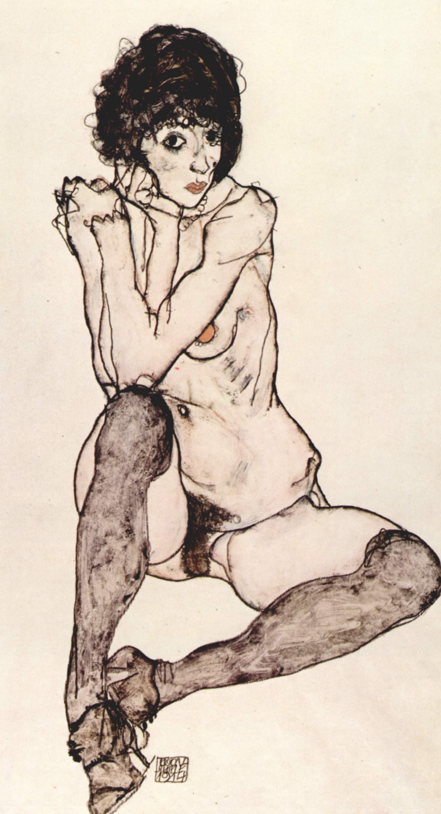

Title: Upplýsing og afneitun: Undir oki siðmenningar
Subtitle: Aðferð, framfarir og fullkomnun.
Slug: upplysing-og-afneitun-undir-oki-sidmenningar
Date: 2008-10-30 11:55:37
UID: 750
Lang: is
Author: Karl Jóhann Garðarsson
Part: 1/2
Author URL: 
Category: Heimspeki, Sagnfræði, Sálfræði
Tags: Sigmund Freud, Peter Gay, Herbert Marcuse, Undir oki siðmenningar, Blekking trúarinnar, trúarbrögð, menning, Heimspeki, Sálfræði, Saga, upplýsing, framfarir, fullkomnun, sálgreining, Samfélag, siðmenning, hamingja, Eros, Þanatos, lífshvöt, dauðahvöt, framþróun

Áhrifa Sigmunds Freuds gætir hvarvetna í dag og kenningar hans hafa orðið hluti af almennum orðaforða. Það er ekki ástæðulaust að Peter Gay nefndi Freud „Kólumbus hugans".[^1]  Áhrifamáttur Freuds á sjálfsmynd nútímafólks hvetur okkur til að líta á áhrifavalda hans. Hér verður litið á hvernig Freud brást við hugsjónum upplýsingarinnar í einni af síðustu bókum sínum, _Undir oki siðmenningar_ (_Das Unbehagen in der kultur_). Freud hafnaði möguleikanum á mörgum hugsjónum upplýsingarinnar jafnframt því að efast um hvort gott væri að reyna að ná þessum göfugu markmiðum en á sama tíma hélt hann kyndli upplýsingarinnar hátt á lofti. _Blekking trúarinnar _(_Die Zukunft einer Illusion_), næsta bók Freuds á undan _Undan oki siðmenningar_, hefur verið lýst sem uppgjöf fyrir upplýsingunni.[^2]  Færð verða rök fyrir því að hið gagnstæða megi segja um síðarnefndu bókina og er þá helst litið til framfara, fullkomnunar, hamingju og frelsis.

_Undir oki siðmenningar_ er hluti af síðari ritum Freuds sem fjalla um trúarbrögð og menningu, þar sem Freud notar sálgreingar aðferð sína til að útskýra og skilja nútíma samfélag. Allt byggist á starfsemi hugans í kenningum Freuds og eftir að hafa uppgvötað sálfræðilegar frumsetningar hugans bjó hann til sögu um hvernig þessi öfl urðu til. Í fjarlægri forsögulegri fortíð ímyndar Freud sér röð atburða sem leggja undirstöðurnar fyrir siðmenningu og móta sál alls mannkyns til þessa dags.[^3]  Þarna er á ferðinni frumbernska mannkynsins og líkt og með frumbernsku einstaklinga er þar að finna orsakir sálfræðilegra erfiðleika. Í _Siðmenningunni_ lýsir Freud því hvernig öflin sem mótuðu siðmenninguna í upphafi halda áfram að ásækja okkur en móta líka samfélagið og viðhorf okkar til þess. Hér er um nokkurn viðsnúning að ræða þegar litið er til upplýsingarinnar. Litið er á hug og sál einstaklings til að útskýra samfélagið, í stað þess að horfa til náttúrunnar og samfélagsins til að skilja manneskjuna betur, og þannig eru hugmyndir um yfirsjálf einstaklings yfirfærðar á samfélagið.[^4]  Þegar rætt er um aðferðir Freuds eru þó stærri atriði sem festa hann við arfleið upplýsingarinnar en slíta hann frá henni. Hann reynir að skilja náttúruna og mannkynið, notar til þess þekkingu og rökhugsun með heildarsýn á mannkynið. Þá minnir hin skáldaða atburðarás á hið náttúrulega ástand sem stjórnmálaheimspekingum 17. og 18. aldar var hugleikið. Þá eru hugmyndir Freuds að hans mati ekki bundnar við stað eða stund heldur eru þær algildar fyrir alla menn, líkt og upplýsingamönnum var tamt á líta á eigin hugmyndir.

Freud hélt stofu sinni alla tíð opinni og vann með sjúklingum sínum að því að leysa úr vandamálum þeirra. Þetta skiptir máli því það sýnir fram á að Freud trúði a.m.k. nóg á áhrifamátt vísinda sinna til þess að halda starfi sínu áfram þrátt fyrir háan aldur. Þessa trú hans á að með röklegri beitingu vísindalegra aðferða væri hægt að skilja einstaklinginn betur og þá nýju þekkingu mætti svo nota til að gera viðkomandi að betri manni á Freud, sitjandi við sófann, sameiginlega með upplýsingunni. Framfarir og hamingja voru ekki utan seilingar heldur skylda hvers manns að stefna að. Hvernig passar þetta jákvæða og vísindalega viðhorf þó við að _Siðmenningin_ er vægðarlausasta verk Freuds?

Eros og Þanatos (lífshvöt og dauðahvöt) eru þær hugarhvatir sem stjórna lífi okkar og siðmenningu samkvæmt _Siðmenningu_ gegna meðal annars því mikilvæga hlutverki að skapa og viðhalda siðmenningunni.[^5]  Hvatirnar knýja þannig framþróun samfélagsins í göfugu formi sínu. En hvatirnar eru ávallt bældar sem þýðir að ekki er hægt að uppfylla þær sem þýðir að sannri hamingju verður ekki náð. Frekari framþróun leiðir af sér meiri bælingu og eyðileggingu.[^6]  Þrátt fyrir að knýja framþróunina verður aldrei nein framþróun hjá hvötunum sjálfum, þær eru fastar í linnulausri og eilífri baráttu sín á milli sem hvorug getur sigrað.[^7]  Sökum þessa er engin von um að fullkomnun hugans, við stjórnumst og munum stjórnast af sömu uppbyggingu hugans og kom fram í frum-hjörðinni. Þannig hefur Freud í _Siðmenningunni_ í raun afneitað möguleikanum á framförum og fullkomnun hugans.

Hér er um mikilvægt fráhvarf frá upplýsingunni að ræða, þar sem framför og fullkomnun á öllum sviðum er talin möguleg. En það er ekki síður rökin að baki þessari höfnun sem eru framandi klassískri hugsun upplýsingarinnar. Í hugsjónum hennar felst að leiðin að framförum og fullkomnun felst í menntun, að með því að gera samfélagið menntaðra, siðaðra röklegra og fágaðra væri hægt að breyta og bæta einstaklingnum. Með öðrum orðum trú á utanaðkomandi öfl, að með breyttu umhverfi sé hægt að umbylta mannkyninu og að þessi öfl geri okkur að því sem við erum í dag. Freud hins vegar trúir ekki á slíka betrun en bætir um betur og hafnar umhverfinu sem mikilvægustu breytunni í mannlegu lífi og horfir inn á við, á hug hvers manns. Forgangur hins sálræna koma skýrt fram í því að siðmenningin er afleiðing baráttu hugarhvatanna en ekki öfugt.[^8]  Þess vegna skipta framfarir og fullkomnun ekki miklu máli fyrir Freud, heldur hvernig hugurinn starfar. Þar sem uppbygging hans getur ekki tekið framförum er lítið áunnið með sífellt „siðaðra" samfélags.

Þýski heimspekingurinn Herbert Marcuse leggur áherslu á, í túlkun sinni á Freud, að framþróun samfélagsins ýti undir baráttuna milli hvatanna.[^9]  Vekur Marcuse þar athygli á mikilvægu fráhvarfi Freuds frá hugsjóninni um framfarir. Samkvæmt Freud leiðir sífelld aukning rökhyggja, sem upplýsingamenn sáu sem markmið, til meiri bælingar. Í stað þess að taka rökhyggjunni fagnandi sem leiðinni til frelsunar og framfara sá Freud siðmenninguna verða án afláts sjúkari og taugaveiklaðri.[^10]  Munurinn á afstöðu Freuds og upplýsingarinnar til framfara og fullkomnunar er engin tilviljun. Upplýsingin var hugmyndafræðilegur grunnur Freuds og hann var fullkomnlega meðvitaður um það.[^11]  Þegar hann lýsir hugmyndina um framfarir skaðlega fyrir mannshugann og ónáanlegar í uppbyggingu hugans var Freud meðvitað að hafna hugmynd sem liggur til grundvallar allri arfleið upplýsingarinnar.

[^1]: Peter Gay, _Freud,_ _Jews and Other Germans. Masters and Victims in Modernist Culture_. Oxford University Press (New York, 1978), s. 35.
[^2]: Herbert Marcuse, _Eros and Civilization. A Philosophical Inquiry into Freud_. Allen Lane (London, 1970), s. 72.
[^3]: Sigmund Freud, _Civilization and Its Discontents_. Þýtt af David McLintock. Penguin (London, 2002) s. 36-37 og 68-69. Bókin er líka til í íslenskri þýðingu, sjá: Sigmund Freud, _Undir oki siðmenningar_. Þýtt af Sigurjóni Björnssyni. Hið íslenzka bókmenntafélag (Reykjavík, 1997 2. útgáfa). Þá má líka nálgast eldri enska þýðingu endurgjaldslaust á netinu, sjá: Sigmund Freud, _Civilization and Its Discontents_. Þýtt af James Starchy. Norton (New York, 1961), [http://ia340930.us.archive.org/0/items/CivilizationAndItsDiscontents/freud_civilization_and_its_discontents.pdf ](http://ia340930.us.archive.org/0/items/CivilizationAndItsDiscontents/freud_civilization_and_its_discontents.pdf)
[^4]: Freud, _Civilization_, s. 77.
[^5]: Freud, _Civilization_, s. 34.
[^6]: Marcuse, _Eros_, s. 54  &87-89.
[^7]: Freud, _Civilization_, s. 58.
[^8]: Freud, _Civilization_, s. 58.
[^9]: Marcuse, _Eros_, s. 54 & 87-89. Þessi aukna spenna er mikilvæg fyrir frelsun í hugmyndum Marcuse en þær verða til umfjöllunar í seinni hluta.
[^10]: Yiannis Gabriel, _Freud and Society_. Routledge (London, 1983) s. 99. Jeffrey B. Abramson, _Liberation and its limits. The moral and Political Thought of Freud_. The Free Press, New York 1984, s. 137.
[^11]: Peter Gay, _Godless Jew Freud, Atheism, and the Making of Psychoanalysis_. Yale University Press (New Haven, 1987), s. 42.
