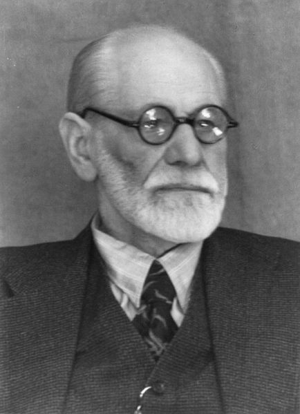
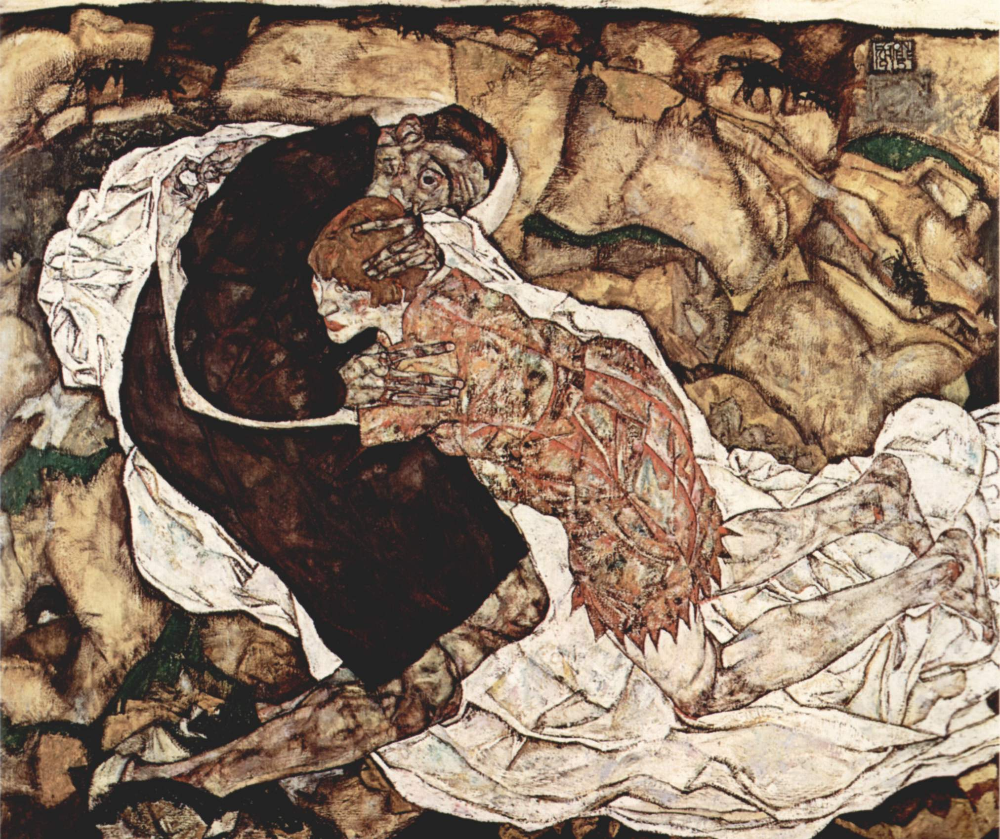

Title: Upplýsing og afneitun: Undir oki siðmenningar
Subtitle: Hamingja, sektarkennd og frelsun
Slug: upplysing-og-afneitun-undir-oki-sidmenningar
Date: 2008-11-04 09:50:19
UID: 769
Part: 2/4
Lang: is
Author: Karl Jóhann Garðarsson
Author URL: 
Category: Heimspeki, Sagnfræði, Sálfræði
Tags: Sigmund Freud, Peter Gay, Herbert Marcuse, Undir oki siðmenningar, Civilization and its discontents, sálgreining, upplýsing, Sálfræði, Sagnfræði, hugmyndasaga, siðmenning, Samfélag, hamingja, sektarkennd, frelsun, lausn, bati, hugsýki

Tilgangur lífsins er, samkvæmt Freud, að vera hamingjusamur sem þýðir bæði að leitast eftir sælu og forðast sársauka og óþægindi.[^1]  Þessu náum við hins vegar aldrei því langvarandi hamingja er ómöguleg - sæla og hamingja mótast og eru skilgreindar af andstæðu sinni. Þjáningin leitar á okkur úr þremur áttum, frá okkur sjálfum og líkama okkar, frá veröldinni í kringum okkur og að lokum frá mannlegum samskiptum.[^2]  Allar leiðir sem okkur eru færar til að forðast þessar byrðar lífsins falla undir hatt siðmenningarinnar, sem er eins konar vörn gegn sársaukanum og þjáningunum sem mynda líf okkar. Á hinn bóginn er siðmenningin það sem helst ýtir undir óhamingju okkar og áðurnefndar leiðir eru einungis flóttaleiðir sem gera lífið bærilegt en úthýsa ekki þjáningunni. Þessi þversagnakennda staða er órjúfanlegur hluti af samfélaginu og er drifin af baráttunni milli Eros og Þanatos. Fyrst siðmenningin gefur okkur enga von um að ná tilgangi okkar í lífinu, hamingju, ættum við þá að yfirgefa siðmenninguna?[^3]

Engin lausn felst í því að mati Freuds og benti hann á að í frumhjörðinni hafi einungis höfuðpaur hennar getað verið hamingjusamur en sú hamingja var heldur ekki ótakmörkuð en allir aðrir voru undir þrælslegri kúgun. Þar að auki héldi fortíðin áfram að leita á huga okkar svo sektarkennd okkar hyrfi aldrei. Við þurfum því að horfa á „ódauðlegan Eros láta til sín taka í baráttunni við ódauðlegan andstæðing sinn."[^4]  Hér neitar Freud aftur þeirri fullkomnun sem upplýsingin stefndi að. Hins vegar er hugmyndin um hamingju sem tilgang mannsins í þessu lífi hluti af grunngildum upplýsingarinnar. Freud var ekki að hverfa til tímans fyrir upplýsingu og húmanisma þegar hamingju var einungis að vænta í eftirlífinu en í heimssýn hans eins og hún birtist í _Undir oki siðmenningar_ virðist möguleiki á því að uppfylla tilgang lífsins, hamingju, ekki vera til. Að einhverju leiti er þessi heimssýn svolítið Hobbes-ísk, lífið virðist vera einsamalt, fátæklegt, andstyggilegt, dýrslegt og stutt.[^5]  En Freud talaði samt sem áður fyrir því að við gætum bætt líf okkar lítillega og að við gætum ekki, sökum sálfræðilegrar uppbyggingar hugans, hætt að leitast eftir ánægju og hamingju.

Tilgangur _Siðmenningar_ Freuds var að „kynna sektarkennd sem mikilvægasta vandamálið í þróun siðmenningar og sýna að við kaupum menningarlegar framfarir á kostnað hamingjunnar vegna síaukinnar sektarkenndar."[^6]  Sektarkennd siðmenningarinnar hófst með drápi föðurs frumhjarðarinnar af hendi sona hans. Synirnir bæði hötuðu og elskuðu föður sinn og fundu því til eftirsjáar og sektar eftir morðið og fundu upp hömlur sem kæmu í veg fyrir endurtekningu þess. Þessar hömlur, taboo, koma í veg fyrir að samfélög láti undan Eros eða Þanatos hvötunum. En hömlurnar ýta á sama tíma undir aukna sekarkennd.[^7]  Og þegar siðvæðing eykst, aukast hömlurnar og þar með sektarkenndin. Hugmyndin um að sálfræðileg vandamál séu hluti af og aukist með framförum og samfélaginu leiðir til svartsýni Freuds um möguleikan á bata siðmenningarinnar.

Að baki ofansögðu (og fyrri hluta greinarinnar) liggur einn og sami vandinn, frelsun eða lausn; sá Freud möguleika á frelsun siðmenningarinnar og frelsun einstaklinga frá menningu í _Siðmenningunni_? Ef Freud eygði ekki von um lausn, hvernig passar það við sálgreiningar starf hans og markmið lífsstarfs hans? Lausn mannsins er líka undirliggjandi hugtak í þeim hugsjónum upplýsingarinnar sem hér hafa verið ræddar; hamingja, fullkomnun og framfarir gera ráð fyrir að hægt sé að leysa manninn undan núverandi stöðu hans og lyfta honum til betri stöðu.

Frelsunin sem Freud leitar eftir fyrir sjúklinga sína verður þó að greina frá mögulegri frelsun samfélagsins. Sálgreining gat einungis frelsað einstaklinginn til „venjulegrar óhamingju hversdagsleikans" eða með öðrum orðum til menningarinnar.[^8]  En ef sú menning og siðmenning er hugsjúk, líkt og Freud heldur fram, hversu mikla frelsun býður sálgreining upp á og getur hún boðið frelsi frá hinni sjúku menningu? Aðgreining milli kenninga og starfs Freuds sem og milli frelsunar einstaklinga og samfélags þýðir þó ekki að Freud hafi algerlega afskrifað frelsun í kenningu sinni. En hann var svartsýnn en þó tvíræður varðandi mögulega lausn og tvíræðnina verður að athuga betur. Annars vegar er hið nokkuð bjartsýna viðhorf að einn daginn komi fram „sjúkdómafræðileg könnun á menningar samfélögum" sem væri bæði áhugaverð og hvorki „fáranleg né dæmd til gagnsleysis."[^9]  Og líkt og greining einstaklings getur frelsað hann frá sýki hans getur greining samfélags vísað veginn til frelsunar samfélaga. Herbert Marcuse byggði mjög á þessari hugmynd í áhugaverðri bók sinni _Eros and Civilization_ þar sem hann sníður nýja siðmenningu.[^10]  En hin hliðin í skrifum Freuds, sú svartsýna, kemur strax á eftir þeirri bjartsýnu. Freud gat ekki reitt fram neina huggun fyrir sjúklegu ástandi siðmenningarinnar og varaði við innbyggðum vandkvæðum siðmenningar sem byðu öllum tilraunum til endurbóta birginn.[^11]  Sagnfræðingurinn Peter Gay leggur, ólíkt Marcuse, áherslu á þessa hlið hugmynda Freuds og segir að Freud hafi ekki séð neina útgönguleið vegna áhrifa siðmenningarinnar. Þar með verður það hjá Gay merki um „dularfulla óskhyggju sem er við hæfi barna, villimanna og taugaveiklaðra" að halda að hægt sé að lækna siðmenninguna endanlega.[^12]

Þegar skoðanir Marcuse og Gay eru bornar saman sést hversu ólíkar niðurstöðurnar verða eftir því á hvaða hliðar hugmynda Freuds er lögð áhersla. Að mati undirritaðs er athyglisvert í þessu samhengi að hafa í huga tilgang _Siðmenningarinnar_, bókinni var jú ætlað að hjálpa fólki að skilja veröldina betur. Sjálfsvitund var forsenda bata þeirra sem lögðust á sófann hjá Freud en vafasamt verður að teljast að slíkri sjálfsvitund sé hægt að ná hjá samfélaginu í heild en ekki bara einstaklingum. Jafnvel þó siðmenningin í heild næði upp einhvers konar sjálfsvitund er óljóst í hverju batinn/frelsunin liggi ef hún væri möguleg. Frelsun einstaklinga felst einungis í „venjulegri óhamingju" og er því afar takmörkuð - hvert myndi frelsun samfélagins leiða? Og jafnvel ef litið er á _Siðmenninguna_ sem hjálp við að auka sjálfsvitundina er það ekki á grundvelli samfélagsins heldur vitund einstaklinga innan þess um stöðu sína. Og slík vitneskja segir Freud í lok bókarinnar hefur leitt til „óhamingju, kvíða og óróleika" nútíma mannsins.[^13]  Vandamálið er því þekkt en það hjálpar okkur ekki, við getum samt sem áður ekki leyst siðmenninguna úr fjötrum sínum eða okkur úr fjötrum siðmenningarinnar.

Aukin þekking leiðir þannig ekki til lausnar og hefur Freud þar með nánast algerlega afneitað helstu hugsjónum upplýsingarinnar. Hamingja, frelsun, framfarir og fullkomnun er meira og minna vísað frá af „dyggum syni upplýsingarinnr".[^14]  Rætur starfs Freuds liggja í upplýsingunni og skýrir það nokkuð hvers vegna textinn er jafn dökkur og raun ber vitni, í _Undir oki siðmenningar_ færir hann rök fyrir því að hugsjónir þær sem hann byggði lífsstarf sitt á geti aldrei orðið að veruleika eða séu hreinlega skaðlegar sálarheilsu mannkynsins. Þannig notaði Freud aðferðir og orðfæri upplýsingarinnar gegn grunngildum hennar.

[^1]: Sigmund Freud, _Civilization and its Discontents_. David McLintock þýddi. Penguin (London, 2002), s. 14. Í fyrri hluta má sjá frekari upplýsingar um bókina.
[^2]: Freud, _Civilization_, s. 15.
[^3]: Freud, _Civilization_, s. 25 & 51.
[^4]: Freud, _Civilization_, s. 92.
[^5]: Peter Gay, _Freud. A life for our time_. J.M. Dent & Sons (London, 1988), s. 546.
[^6]: Freud, Civilization, s. 71.
[^7]: Freud, _Civilization_, s. 68-69.
[^8]: Jeffrey B. Abramson, _Liberation and its limits. The moral and Political Thought of Freud_. The Free Press (New York, 1984), s. 122.
[^9]: Freud, _Civilization_, s. 80.
[^10]: Herbert Marcuse, _Eros and Civilization. A Philosophical Inquiry into Freud_. Allen Lane (London, 1970).
[^11]: Freud, _Civilization_, s.81 & 52.
[^12]: Peter Gay, _Freud, Jews and Other Germans. Masters and Victims in Modernist Culture_. Oxford University Press (New York, 1978), s. 69.
[^13]: Freud, _Civilization_, s. 81.
[^14]: Peter Gay, _A Godless Jew. Freud, Atheism, and the Making of Psychoanalysis_. Yale University Press (New Haven, 1987), s. 41.
