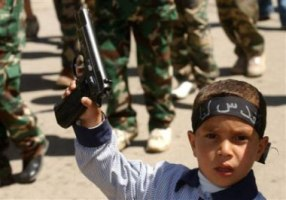

Title: Uppreisnarbörn
Slug: uppreisnarboern
Date: 2006-06-22 13:05:15
UID: 80
Lang: is
Author: Helga Tryggvadóttir
Author URL: 
Category: Mannfræði
Tags: 

Flest höfum við væntanlega séð fréttaljósmyndir frá Palestínu af börnum kastandi steinum í átt að þungvopnuðum ísraelskum skriðdrekum. Eitt af einkennum uppreisnanna í Palestínu (intifada) í hugum fólks er mikil og áberandi þátttaka barna í þeim. Sú þátttaka var jafnvel enn meiri í fyrri uppreisninni sem átti sér stað á árunum 1987-1993 en í þeirri síðari sem hefur nú staðið frá árinu 2000.

Sumir hafa haldið því fram að ástæðan fyrir þátttöku barnanna í baráttunni sé sú að þeim sé innrætt það frá unga aldri. Til að mynda er það opinber afstaða Ísraela að palestínska heimastjórnin sé ábyrg fyrir því að innræta palestínskum börnum gyðingahatur og kenna þeim að beita ofbeldi og drepa. Rannsókn George Washington háskóla sýndi hins vegar fram á að ekki var að finna rasisma né gyðingahatur í palestínsku námsefni.

Oft vita foreldrar ekki einu sinni af þátttöku barna sinna fyrr en þau slasast eða lenda í fangelsi. Algengt er að börnin leiki sér á götunni, ekki síst sökum plássleysis heima fyrir. Leikirnir endurspegla þá raunveruleika barnanna þar sem þau þykjast vera annað hvort Gyðingar eða Arabar og fara í stríð. Ekki er óalgengt að þau leiki það að hafa verið drepin. Athyglisvert er að mörg þeirra vildu fremur leika Gyðinga, þar sem þeir eru valdameiri aðilinn. Hættulegasti leikurinn er þó þegar þau mana hvort annað upp í að henda steinum í átt að Ísraelsher.

Rannsóknir hafa verið gerðar á andlegri heilsu palestínskra barna og hefur komið í ljós að hlutfall áfallastreituröskunar (PTSD) er mjög hátt meðal þeirra, en um 73% barna hafa sýnt einkenni hennar. Misjafnt er hvernig börnin bregðast við þessum aðstæðum. Sum þeirra verða mjög óörugg og með lágt sjálfsálit á meðan önnur sýna mikla reiði og fá útrás með árásargirni. Samkvæmt skýrslu frá Unicef (2002) þá eru sálræn áhrif hernámsins á börnin meðal annars að þau fá martraðir, væta rúmin og þjást af svefnleysi og ótta, ekki síst myrkfælni. Önnur verða sífellt árásargjarnari sökum sífelldra skothríða og nærveru óvinahers. Þau sem taka þátt í uppreisninni læra að leysa sín mál með ofbeldi og eru þá líklegri til þess að nota það innan skólans líka.

En áhrifin eru ekki bara sálræn heldur einnig mjög áþreifanleg í formi áverka eða jafnvel dauða barnanna. Mannfræðingurinn Maya Rosenfeld segir að á meðan rannsókn hennar í palestínskum flóttamannabúðum stóð hafi ellefu íbúar flóttamannabúðanna verið skotnir til bana, nánast allt ungt fólk. Þar af voru þrír á aldrinum tíu til þrettán ára. Hundruð annarra voru særð sökum skothríðar, ýmist með venjulegum kúlum eða gúmmíkúlum. Flest barnanna sem voru særð eða drepin af Ísraelsher voru ekki þátttakendur í mótmælum gegn Ísraelsher heldur verið fórnarlömb skriðdreka eða þyrluárása á meðan þau voru í friðsamlegum erindagjörðum.

Ekki síður hlýtur það að hafa áhrif á börn að sæta löngum yfirheyrslum og jafnvel fangelsisdvöl á unga aldri. Í Palestínu er óvenju hátt hlutfall karlmanna sem hefur setið í fangelsi, og þá sérstaklega af yngri kynslóðinni. Samkvæmt skýrslu frá Sameinuðu þjóðunum höfðu um þúsund börn verið handtekin á árunum 2000-2002. Yfir 90% voru handtekin fyrir að kasta steinum í átt að ísraleskum hermönnum. Þessar tölur eiga við börn undir átján ára aldri en þess voru þónokkur dæmi að börn niður í þrettán ára gömul væru handtekin.

Í ísraelskum lögum er leyfilegt að halda einstaklingi í varðhaldi í átján daga án réttartilskipunar. Það má lengja upp í sex mánuði með tilskipun frá dómara. Seinka má því að kalla til lögfræðing í þrjátíu daga. Unglingar eru síðan dæmdir í ísraelskum herrétti. Því má sjá að réttarumhverfið er ekki hliðhollt palestínskum börnum. Ísraelsher stundar það að handtaka einstaklinga og sleppa þeim eftir átján daga, en handtaka þá síðan strax aftur. Þetta veldur því oft að börn og unglingar sitja inni meira og minna í marga mánuði án þess að vera kærð.

Þegar palestínska heimastjórnin og herská andspyrnusamtök hafa ekkert að segja gagnvart ofurafli ísraelska hersins eru það börnin sem mótmæla sem tekst helst að ergja hernámsliðið. Á móti kemur að þó þau ergi það þá tekst þeim ekki að gera mikið meira en það. Börnin verða því örg yfir því að hafa „smjörþef af valdi en þó ekki raunveruleg áhrif á aðstæður sínar.“[^1] 

 Mannréttindalögfræðingurinn Siraj Sait segir að barátta barna í fyrri uppreisninni hafi skilað einhverjum árangri þar sem samningsstaða Palestínumanna hafi batnað í kjölfar hennar. Nú sé hins vegar annað uppi á teningnum þar sem þar sem þau hundruð barna sem látið hafa lífið í átökunum og þúsundir sem hafa særst hafi í raun látið lífið til lítils þar sem dauði þeirra virðist ekki þrýsta á um neina lausn á deilunni. Í fyrri uppreisninni höfðu börnin táknræn áhrif þar sem fólki brá að sjá fréttamyndirnar af þeim kastandi steinum í brynvarða hermenn. Börnin eru ekki eins áberandi nú úti á götunum og þau voru í fyrri uppreisninni þar sem minna er um bein átök þeirra og hersins.

Í fyrri uppreisninni höfðu börnin táknræn áhrif þar sem fólk sá þau sem táknmynd yfir valdaleysi Palestínu gagnvart Ísrael. Nú virðist fólk hins vegar vera hætt að kippa sér mikið upp við fréttir af börnum í Palestínu. Skilningur á málstað Palestínumanna hefur minnkað í kjölfar hryðjuverkanna 11. september sökum harðari afstöðu gagnvart hryðjuverkum. Þetta kemur einnig niður á börnunum þar sem þau hljóta einnig minni samúð alþjóðasamfélagsins. Erum við orðin svo vænisjúk eftir 11.september að okkur er sama um alla „hryðjuverkamenn“, hvort sem þeir eru börn eða ekki? Núverandi staða bitnar á börnum beggja megin víglínunnar þar sem fremur virðist um einhvers konar sjúka keppni milli beggja aðila um hver geti státað sig af yngsta píslavættinum. 

Skortur á eigindlegum gögnum þar sem börn eru spurð út í sínar aðstæður er tilfinnanlegur og því er sífellt verið að leggja þeim orð í munn. Það veldur því einnig að þau eru misskilin eða ekki gerð tilraun til þess að skilja þau yfir höfuð. Þetta á einnig við í umræðum um palestínsk börn. Þannig er myndin sem oft er birt af þeim í vestrænum fjölmiðlum gjarnan afar dökk þar sem ekkert er reynt að skilja hvað ýtir þeim út í þessar aðgerðir. Þess í stað er dregin upp mynd af viðbrögðum þeirra sem ónáttúrulegum, órökréttum og jafnvel „illum“

Oft er ekki litið á átökin út frá sjónarhóli palestínskra barna, heldur einungis þannig að þau séu að taka þátt í „fullorðins“ átökum. Því er annað hvort litið á börn sem þögul fórnarlömb eða leikbrúður fullorðinna sem hvorki hafi réttindi né áhrif á framvindu mála. Í könnun sem gerð var á framtíðarsýn palestínskra barna kom það í ljós að einungis 2 börn af 120 sáu fyrir sér stofnun sjálfstæðs ríkis. Framtíðarsýn hinna 118 var mjög svartsýn þar sem þau sáu einungis fyrir sér áframhaldandi hörmungar og fátækt. Uppreisnirnar í Palestínu snúast ekki síst um það hvernig framtíð fólk geti búið börnunum sínum. Ef átökin eru einhverra þá eru þau þeirra. 

---

#### Heimildir

* Rosenfeld, Maya. 2004. _Confronting the Occupation: Work, Education and Political Activism of Palestinian Families in a Refugee Camp_. Stanford California: Stanford University Press.
* Sait, M. Siraj. 2004. Have Palestinian Children Forfeited Their Rights? _Journal of Comparative Family Studies_. 35(2): Bls. 211-228.
* Srour, Roney W. 2005. Children Living Under a Multi-traumatic Environment: The Palestinian Case. _The Israel Journal of Psychiatry and Related Sciences_. 42(2);  88-95.

[^1]: Sait, M. Siraj. 2004. Have Palestinian Children Forfeited Their Rights? _Journal of Comparative Family Studies_. 35(2): Bls. 211-228.

