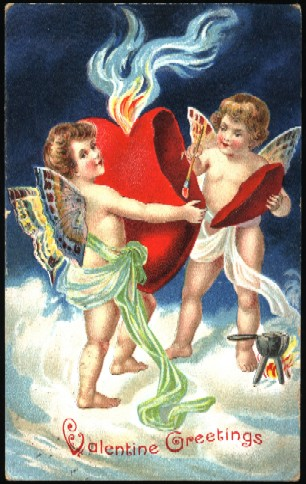
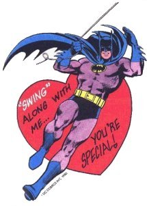

Title: Valentínusardagurinn: forboðnar giftingar og súkkulaðibangsar
Slug: valentinusardagurinn
Date: 2006-02-14 09:00:00
UID: 44
Lang: is
Author: Karl Jóhann Jóhannsson
Author URL: 
Category: Íslendingar, Þjóðfræði
Tags: 

Valentínusardagurinn fellur ár hvert á 14. febrúar og er í vestrænu samfélagi algengt að elskendur og aðrir tjái ást sína með því að gefa blóm, súkkulaði, nuddolíur, kynlífstæki eða hvað það er sem verslunarmönnum dettur í hug að flokka sem rómantíska gjöf.  Upprunalega hefðin var þó sú að senda bréf eða kort til sinnar heittelskuðu, hefð sem í dag veldur sölu um miljarða valentínusarkorta á ári hverju, einungis jólakortin eru þeim vinsælli.

Margir telja Valentínusardaginn vera bandarískt fyrirbæri.  Í gær heyrði ég mann á rás 2 hneykslast yfir því að íslendingar skyldu vilja halda upp á daginn og spyrja hvort við ættum ekki einnig að taka upp á því að halda upp á þakkargjörðarhátíðina og 4. júlí, þjóðhátíðardag bandaríkjamanna.

Því verður ekki neitað að fólkið þarna vestan hafs hafi verið duglegt að tileinka sér þennan sið og jafnvel ofgert honum.  Ég ætla ekki heldur að neita því að mér þykir kalkúnn afar gómsætur, en þrátt fyrir það er ég ekki tilbúinn að tileinka mér tvær síðastnefndu hátíðirnar, sem báðar eiga rætur sínar að rekja til Bandaríkjanna, ólíkt valentínusardeginum.

Áður en hann var kenndur við Valentínus var þessi dagur haldinn til heiðurs rómverska frjósemisguðinum Lupercus og var í þá daga slátrað geit og drukkið vín auk þess sem menn hlupu um bæinn útataðir í blóði.  Eftir að þáverandi keisari Rómar hafði bannað hjónabönd, þar sem hann komst að þeirri niðurstöðu að einhleypir karlmenn væru betri hermenn, og kristnin hafði verið gerð að ríkistrú í Rómaveldi var dagurinn eignaður Valentínusi, presti sem var hálshöggvinn þennan dag fyrir að gefa saman ung pör sem mátti ekki gefa saman, eða svo segir sagan.

Eftir aftöku var Valentínus titlaður verndari elskenda og dagurinn loks haldin honum til heiðurs.  Þess má þó geta að árið 1969 fjarlægði Kaþólska kirkjan Valentínusardag af dagatalinu sínu þar sem ekki þótti sýnt fram á að þessar sögur væru annað en bara sögur.   Hjónabönd á þessum tíma voru ekki oft tilkomin vegna ástar manns og konu heldur af ýmsum öðrum hentugleika-ástæðum og er því einnig ólíklegt að dýrlingur yrði titlaður verndari elskenda á tímum þegar rómantísk ást var ekki fullmótað hugtak.  Það er þó kannski fullgróft að ætla að ungt fólk hafi ekki fellt saman huga sína en það má að minnsta kosti gera ráð fyrir að kort og súkkulaði hafi ekki verið algeng gjöf á þessum degi fyrstu aldirnar á okkar tímatali.

Samkvæmt þessu hefur verið haldið upp á þennan dag í árþúsundir, þó að bandaríkjamenn hafi ofgert honum eins og þeim einum er lagið frekar nýlega.  Við íslendingar höfum að sjálfsögðu tekið þennan sið beint að vestan svo ekki er óeðlilegt að halda að hann sé frá þeim kominn.  Þar sem þessi hefð er í raun frá könunum komin má hver sem kýs að afþakka hana gera svo í fullum rétti, enda eigum við tvo ágæta daga til að halda upp á maka okkar, annar var fyrir nokkrum vikum og hinn er eftir rétt rúma viku.

Konudagurinn er á fyrsta degi góu. Á konudaginn er venja að eiginmenn gefi konum sínum blóm til merkis um eilífa ást þeirra á konunni, eða kannski bara til að halda friðinn.  Konudagurinn hefur aðeins öðruvísi ímynd en Valentínusardagurinn, hann virðist vera meira fyrir gift, eða að minnsta kosti langt komin, pör, á meðan að það er til dæmis haldið upp á Valentínusardaginn í grunnskólum Bandaríkjanna þar sem 6 ára börn skiptast á valentínusarkortum.

Þegar ég var yngri bjó ég einmitt í Bandaríkjunum og man vel eftir því þegar við bekkjarfélagarnir eyddum hluta skóladagsins í að útbúa litla pappakassa með bréfalími, glimmer og slíku sem þjónuðu sem póstkassar fyrir valentínusarkort.  Allir áttu að útbúa kort fyrir þá sem þeir vildu gefa og dreifðu þeim svo samtímis um stofuna til að koma í veg fyrir vandræðalegar aðstæður.

Um það leyti sem krökkunum er hætt að lítast á hitt kynið þá er þessu hætt í skólanum en  haldið er áfram frá þeim stað sem var horfið uppúr unglingsárunum þegar strákarnir gefa kærustu sinni gjöf á Valentínusardaginn.

Þetta er líklega ekki í samræmi við konudagshefðir sem eiga nær eingöngu við um alvarlegri sambönd.

Mín ímynd af íslendingum felur ekki í sér mikla rómantík og þeim mun minni væmni, sem eru þó aðalsmerki Valentínusardagsins síðastliðna áratugi.  Engu að síður reyna vikublöð, sjónvarpsþættir og vefsíður að kenna okkur íslendingunum hvernig við getum verið í nánu sambandi við tilfinningar okkar með því að gefa okkar nánustu gjafir og vera þeim góð.

Ef til vill eru einhverjir sem kjósa að líta á Valentínusardaginn sem lélega afsökun til að selja hvað sem kaupmönnum dettur í hug og sú stefna virðist verða smekklausari og ýktari með árunum, allt er hægt að tengja við Valentínusardaginn, allt frá hjartalaga böngsum til syngjandi súkkulaðikorta og unaðsolíum í rauðum flöskum sem anga af súkkulaðilykt.

Hátíðardagar voru vissulega ekki fundnir upp til þess að selja varning verslunarmanna og fullorðið fólk er stundum of duglegt að láta slíkt fara fyrir brjóstið á sér í staðinn fyrir að kaupa ekki þennan varning heldur gera eitthvað sérstakt fyrir elskuna sína, gera sér glaðan dag og gera heiminn að ögn betri stað, ef ekki nema bara í smá stund.

Boðskapurinn er auðvitað sá að þið þurfið ekki afsökun til þess að gleðja ykkar heittelskaða/heittelskuðu, flestir aðrir dagar henta jafnvel betur en í dag, þá kemurðu henni/honum líka á óvart og það er bara skemmtilegra.

