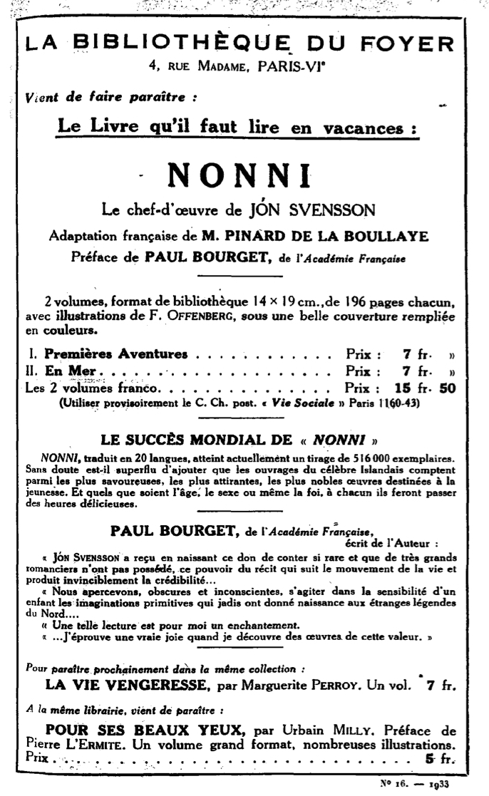

Title: „Vandfýsnasta bókmentaland heimsins“
Sublitle: Franskar þýðingar 1900-1950
Slug: vandfysnasta-bokmentaland-heimsins
Date: 2008-08-14 11:00:22
UID: 456
Part: 1/4
Lang: is
Author: Hanna Steinunn Þorleifsdóttir
Author URL: 
Category: Þýðingafræði, Bókmenntafræði, Bókmenntir, Franska
Tags: Þorsteinn Stefánsson, Fjallkirkjan, Ströndin blá, Gunnar Gunnarsson, Kristmann Guðmundsson, Nótt og draumur, Gallimard, Dalurinn, Þú vínviður hreini, Hellismannasaga, Grettis saga, Salka Valka, Alfred Jolivet, Madeleini Pinard de la Boullaye, Eddukvæði, Gunnlaugs saga ormstungu, Egis saga, Félix Wagner, Skólabræðurnir, Davíð Þorvaldsson, Halldór Laxness, Études, Nonnabækurnar, Nonni og Manni, Fernand Mossé, Laxdæla saga, Halla la femme du bandit, Bóndinn á Hrauni, Dr. Rung, La Revue, Jóhann Sigurjónsson, Léon Pineau, Fjalla-Eyvind, Henrik Ibsen, Nonni, Jón Sveinsson, Grímur kaupmaður deyr, Gestur Pálsson, Bókmenntasjóður Frakka, Frakkland, Franska, Francois Mitterand, Jack Lang, þýðingar, íslenskar bókmenntir, Svartfugl, Cheveux d'or, Steingrímur Arason, Tómas Guðmundsson, Fagra veröld

Frakkar lesa mikið. Þeir lesa í rólegheitunum á leið í og úr vinnu. Leiðin getur oft á tíðum verið löng en hún er yfirleitt aldrei farin á einkabíl. Frakkar lesa alls staðar, hvar sem því verður við komið. Setjast varla niður einir síns liðs heima eða í fjöldanum án þess að hafa bók í hönd. Lesa standandi ef því er að skipta. Bækur eru á viðráðanlegu verði í Frakklandi og vandaðar kiljur vinsælar. Bókabúðir eru í hverri borg og þangað halda Frakkar án þess að hugsa neitt sérstaklega um verðsamanburð því verð er fast á frönskum bókum síðan 1. janúar 1982.[^1]  Lögin um bókaverð, kennd við Jack Lang, menntamálaráðherra í tíð Mitterrands, hafa sannað sig og er öllum ljóst að þau hafa bjargað bókabúðum landsins. Samkvæmt þeim skal verðið standa á bókinni hvar sem hún finnst. Að tveimur árum liðnum er hún, ef viljinn er sá, á frjálsum afslætti, oft á nær helmingsafslætti.[^2]  Sjálfstæðar bókabúðir í landinu eru um 2.500. Bækur eru auðvitað seldar mun víðar, m.a. á stórmörkuðum og öðrum verslunarkeðjum, en alltaf á sama verði og leyfilegur afsláttur er alls staðar stranglega sá sami, 5%. Almennt er sátt um Lang-lögin enda reynslan af þeim framar vonum.

Bókmenntasjóður Frakka styður við útgáfu á margvíslegan hátt. Bókaforlögin geta t.d. sótt um þýðingarstyrk er nemur um helmingi þýðingarkostnaðar.[^3] Sjóðurinn vandar valið á þeim þýðingum sem hann styður. Það borgar sig að gefa út útlendar bókmenntir á frönsku en bókaútgáfa er þó aldrei áhættulaus og því er ávallt vel hugað að kynningu bóka. Bókaútgáfa blómstrar í Frakklandi og því er samkeppnin um athyglina mikil. Áherslan breytist hins vegar þegar verðið er úr sögunni og færist yfir á gæði lesningarinnar.

Það ætti ekki að koma á óvart að langmest er þýtt á frönsku úr ensku (um 60%) en þarnæst koma þýðingar úr japönsku, þýsku og ítölsku og þá þýðingar úr spænsku. Þýðingar úr norrænum málum eru í sjötta sæti en náðu þó varla tveimur prósentum árið 2007.[^4] Þýðingar á íslenskum bókmenntum eiga sér langa en nokkuð slitrótta sögu. Lengi vel voru þær þó afar fátíðar og oft notast við millimál. Bókmenntasjóður Frakka styður hins vegar aðeins við þýðingar úr frummálinu. Sjóðurinn er opinber stofnun og hefur frá upphafi unnið í nánu samráði við forleggjara, höfunda, þýðendur, bókaverði og bóksala.[^6] Í ár er fé sjóðsins 35 milljónir evra.[^7]

Jafnvel þótt fyrri aldir hafi þekkt franskar þýðingar á íslenskum bókmenntum - og þá aðallega einstaka þýðingar á fornbókmenntunum[^7] - birtast þýðingar á íslenskum nútímabókmenntum ekki fyrr en upp úr aldamótum í Frakklandi.

Eftir því sem næst verður komist birtist smásaga Gests Pálssonar _Grímur kaupmaður deyr_ fyrst íslenskra samtímabókmennta í franskri þýðingu 1907.[^8]  Nokkrar af greinum Jóns Sveinssonar (Nonna) birtust einnig á þessum árum í tímariti jesúíta.[^9]  Ári áður en smásaga Gests kom út hafði Nonni t.d. skrifað um íslenskar fornbókmenntir og Henrik Ibsen. Tímarit jesúíta kom út í París hálfsmánaðarlega til 1940 og var þar þónokkuð fjallað um bókmenntir.

Árið 1911 kemur útdráttur úr _Fjalla-Eyvind_ út í tímariti í París en þýðanda er ekki getið.[^10] Léon Pineau (1861-1965) þýðir þar næst af dönsku brot úr leikritum Jóhanns Sigurjónssonar, „un poète dramatique islandais“, og koma þau út í júlíheftum _La Revue_ árið 1914, þ.e. útdrættir úr leikritunum _Dr. Rung_, _Bóndanum á Hrauni_ og _Fjalla-Eyvindi_, sem þýðandinn endurskírir svo skemmtilega, _Halla, la femme du bandit_ (Halla, kona ribbaldans), með leyfi höfundar. Þýðandinn hefur verið í sambandi við Jóhann því honum er annt um að taka það fram að hann hafi fengið bréf frá höfundi 7. nóvember 1912.[^11]  Þá kemur _Laxdæla saga_ út 1914 í þýðingu Fernand Mossé.

Nonnabækurnar voru skrifaðar á þýsku og komu þær fyrstu út 1913 og 1914. Þegar fyrstu kaflar _Nonna og Manna_ birtust í jesúítatímaritinu _Études_ árið 1922 höfðu ævintýrasögur Nonna náð miklum vinsældum.[^12] Jón Sveinsson var þá eins og Halldór Laxness tekur fram í bréfi til hans 1923: „einhver hinn víðast lesni íslenskur rithöfundur sem nú lifir.“[^13] Jón var virtur fyrirlesari og greinahöfundur en enginn íslenskur rithöfundur hafði þá nokkru sinni selst eins vel og hann. Það voru Nonnabækurnar sem rokseldust. Þegar þær fyrstu komu loks út á bók í París 1924 í franskri þýðingu var upplagið komið í hálfa milljón á heimsvísu.[^14]

Smásaga Davíðs Þorvaldssonar, _Skólabræðurnir_, kom síðan út fimm árum seinna í frönsku tímariti í hans eigin þýðingu.[^15] Félix Wagner er ötull þýðandi fornbókmennta og koma þrjár þýðingar út eftir hann á þessum árum, _Egils saga_ (Brussel 1925), _Gunnlaugs saga ormstungu_ (Gand 1927) og _Eddukvæði_ (París 1929).

Yfirleitt er það Madeleine Pinard de la Boullaye sem færir bækur Nonna í franskan búning og koma þær út á bók í Frakklandi upp úr 1930. Bræður Pinard de la Boullaye eru jesúítar og flytja orðið í Notre Dame á föstunni einmitt á svipuðum tíma.[^16] Skyldi Madeleine vera systir þeirra?

Árið 1933 hitti Halldór Laxness prófessor Alfred Jolivet (1885-1966) í París vegna þýðingar á _Sölku Völku_.[^17]  Sama ár kemur _Grettis saga_ út í franskri þýðingu Fernand Mossé. _Hellismannasaga_ kemur út nokkrum árum seinna í þýðingu Alfreds Jolivet.[^18] Þegar Halldór kemur aftur til borgarinnar er prófessorinn búinn að þýða fyrri bók _Sölku Völku_, _Þú vínviður hreini_. Þar er þó aðeins hálf sagan sögð því eins og Laxness segir í bréfi frá París haustið 1938 „það er alveg óhemju erfitt að vera accepteraður í Frakklandi sem norrænn höfundur“.[^19] Framhaldið æxlaðist þannig að það kom mestmegnis í hlut Halldórs sjálfs að ná til áhrifamanna í frönskum bókmenntum og tókst honum það með glæsibrag.  Prófessorinn hélt fínan fyrirlestur á fjölmennu bókmenntakvöldi til heiðurs höfundi og allt gekk upp. Bókin var samþykkt til útgáfu hjá einu virtasta forlagi Frakklands, Gallimard.[^20]

Fjórar bækur eftir Gunnar Gunnarsson voru þýddar af dönsku á árunum 1942 til 1947 af jafnmörgum þýðendum. Fyrstar komu tvær fremstu bækur _Fjallkirkjunnar_ út á einni bók sem varð ákaflega vinsæl í Frakklandi.[^21] Þriðja bók _Fjallkirkjunnar_, _Nótt og draumur_, kom síðan út í franskri þýðingu tveimur árum síðar. Árið 1946 er _Ströndin blá_ eftir Kristmann Guðmundsson þýdd úr þýsku jafnvel þótt hún hafi verið skrifuð á norsku og _Dalurinn_ eftir Þorstein Stefánsson af dönsku. _Svartfugl_ kemur síðan út í franskri þýðingu 1947.[^22]  Útgáfur og endurútgáfur franskra þýðinga á Nonnabókunum eru gerðar allt til 1946.[^23]  Ein önnur barnasaga ratar einnig á franskan bókamarkað árið 1949, þýdd úr amerísku, _Cheveux d’or_ eftir Steingrím Arason.

Það er athyglisvert að kanna hversu langt líður á milli útgáfu bóka íslenskra höfunda og franskrar þýðingar þeirra. Útdráttur úr _Fjalla-Eyvindi_ birtist sama ár og verkið á dönsku, þ.e. beinlínis ári á undan íslensku útgáfunni. Líklegt er að vinsældir _Fjalla-Eyvindar_ hafi orðið til þess að útdrættir úr fleiri leikritum Jóhanns birtust þremur árum síðar, 1914. Nonnabækurnar koma oft svo til samtímis út á mörgum tungumálum en ekki verður betur séð en að þær komi fyrst út í franskri þýðingu um svipað leyti og sú íslenska, 1922.[^24]  Kristmann er þýddur á íslensku 1940 en á frönsku úr millimáli sex árum síðar og stutt er á milli þýðingar á bók Þorsteins Stefánssonar á íslensku og frönsku.[^25] Gunnar Gunnarsson skrifaði _Fjallkirkjuna_ á árunum 1923-1927 og vill svo skemmtilega til að franska þýðingin kemur út um svipað leyti og sú íslenska.[^26]

Gleði Halldórs Laxness yfir útgáfu frönsku þýðingarinnar á _Þú vínviður hreini_, fyrri bók _Sölku Völku_, er réttmæt. Honum hentaði best að skrifa á íslensku en það hefur eflaust ekki verið auðvelt val því það gat hindrað útbreiðslu verka hans. Hann gerði sér fulla grein fyrir vandanum og vann ótrauður að útgáfumálum á öllum vígstöðvum, m.a. í Frakklandi. Árangur hans er stórkostlegur. Hann á fyrstu skáldsöguna sem þýdd er af íslensku á frönsku: „Það er sigur fyrir íslenskuna og íslenskar bókmenntir að ná þannig árángri í vandfýsnasta bókmentalandi heimsins. Svo ég get verið eftir atvikum ánægður.“[^27] Skáldverk Halldórs var þó ekki það eina íslenska í París árið 1939 því ljóðabók Tómasar Guðmundssonar, _Fagra veröld_, kom sömuleiðis út í franskri þýðingu það árið. Ungur íslenskumaður, Pierre Naert að nafni, er höfundur þeirrar þýðingar.[^28]  Þýðingar úr forníslensku þykja verðugt verkefni og eru ekki fátíðar á þessu tímabili en á sama tíma eru aðeins tvær bækur þýddar af íslensku, _Þú vínviður hreini_ og _Fagra veröld_.

[^1]: Félag bóksala: http://www.syndicat-librairie.fr/loi-prix-livre2.php#loi1.
[^2]: Þó var reynt fyrir stuttu með breytingartillögu að stytta þennan tíma (tvö ár) í sex mánuði en vegna öflugra mótmæla á þingi og í þjóðfélaginu var hún ekki samþykkt. Sjá grein í _Le Monde_ 2. júlí 2008: http://www.lemonde.fr/opinions/article/2008/07/02/pour-le-livre-contre-la-deregulation_1065127_3232.html; Athyglisverð í þessu sambandi er grein Indriða G. Þorsteinssonar „Bókaútgáfan í rúst“ í _Morgunblaðinu_ 17. maí 2000, bls. 32.
[^3]: Bókmenntasjóður Frakka (Centre national du livre; skammstafað CNL):http://www.centrenationaldulivre.fr/?Subventions-pour-la-traduction-d,639
[^4]: CNL: http://www.centrenationaldulivre.fr/IMG/pdf/Chiffres-cles_livre_2006-2007.pdf (bls. 3).

[^5]: CNL: http://www.centrenationaldulivre.fr/?Un-peu-d-histoire

[^6]: CNL: http://www.centrenationaldulivre.fr/?-Presentation-

[^7]: Um áhuga Frakka á fornbókmenntunum fyrr á öldum er t.d. hægt að lesa í grein François-Xavier Dillmann „La France et la redécouverte de l’antiquité nordique“, _Les Vikings… Les Scandinaves et l’Europe 800-1200_. Sýningarskrá með samnefndri farandsýningu í París, Berlín og Kaupmannahöfn 1992-1993, bls. 18-23.

[^8]: „Grímur se meurt“ í þýðingu Charles Simond. _La Revue_ du 15 octobre 1907, bls. 505-520.

[^9]: Greinar eftir Nonna um ólík efni birtast í franskri þýðingu í _Études publiées par des Pères de la Compagnie de Jésus_ á árunum 1897-1911: „À cheval à travers l’Islande“, _Études_, 70, 1. mars 1897, bls. 776-810 & framhaldið í _Études_, 71, 4. júní 1897, bls. 60-86; „L’ancienne littérature islandaise“, _Études_, 106, 20. febrúar 1906, bls. 516-529; „Henrik Ibsen“, _Études_, 108, 5. júlí 1906, bls. 92-106; „L’Île de feu. Impressions d’Islande“, _Études_, 117, 10. desember 1908; „Jón Arason. Le dernier évêque catholique d’Islande“, _Études_, 127,  4. júní 1911, bls. 399-405; Sjá rafbókasafn Landsbókasafns Frakka (BnF): http://gallica2.bnf.fr/

[^10]: „Le proscrit et sa femme“ (Útlaginn og kona hans), _La Revue Scandinave_, 2. ár, 8/9, 1911, bls. 650-62.
[^11]: Listi yfir franskar þýðingar á vef háskólans í Caen: http://www.unicaen.fr/traductionsISLANDAIS
[^12]: Fimm fyrstu kaflarnir í tímariti jesúíta (_Études publiées par des Pères de la Compagnie de Jésus_) í  _Études_, 173, 10. desember 1922, bls. 70-93: „Nonni et Manni. Histoire vraie de deux enfants islandais.“
[^13]: Halldór Guðmundsson, _Halldór Laxness, ævisaga,_ Reykjavík, JPV útgáfa, 2004, bls. 145. Þar er vitnað í bréf HKL til Nonna í París 17. mars 1923.
[^14]: _Récit islandais_. _Nonni et Manni_, _Nonni et Elis_. París, Éditions Spes, 1924. Samkvæmt ágætum formála dr. Pierre Scherer, bls. 7-15.
[^15]: _Revue bleue_, LXVII (1929), bls. 650-53.
[^16]: Menningarvefur kaþólsku kirkjunnar: http://arts-cultures.cef.fr/ressource/evnmt03.htm : _Conférences de Carême à Notre-Dame de Paris_ (_„Un millier des conférenciers depuis 1835“_ neðst á síðunni): _„Jésuites et dominicains vont alterner dans ces conférences sacrées : … puis ce fut le tour des jésuites (les Pères Pinard de la Boullaye 1929-1937, Panici 1941-1945, Riquet).“_
[^17]: Halldór Guðmundsson, _Halldór Laxness, ævisaga_, Reykjavík, JPV útgáfa, 2004, bls. 335. Í_ Morgunblaðinu_ kemur fram að prófessorinn hafði komið til Íslands tveimur árum fyrr þegar hann var nýtekinn við embætti í Sorbonne-háskóla en ekki kemur fram hvort hann hitti HKL (_Morgunblaðið_ 13. september 1931, bls. 2).
[^18]: „Jon Arnason Les proscrits de la caverne“, _La Revue bleue_, 3, 1937.
[^19]: Halldór Guðmundsson, _Halldór Laxness, ævisaga_, Reykjavík, JPV útgáfa, 2004, bls. 434. Þar er vitnað í bréf til Ingibjargar Einarsdóttur (Ingu) frá París 21. nóvember 1938.
[^20]: Ibid, bls.  433-435.
[^21]: _Vaisseaux dans le ciel d’après les notes de Uggi Greipsson_. Paris, Stock, 1942.
[^22]: Sú þýðing var síðan endurskoðuð af Gérard Lemarquis og Maríu Gunnarsdóttur og endurútgefin árið 1992.
[^23]: Nýjasta endurþýðingin á Nonnabók úr þýsku er hins vegar frá 2001.
[^24]: Fyrstu fimm kaflar Nonna og Manna birust það árið: „Nonni et Manni. Histoire vraie de deux enfants islandais.“ _Études. Revue bimensuelle publié par des Pères de la compagnie de Jésus_, 173, 10. desember 1922, bls. 70-93; sjá einnig: Nonnasafn Landsbókasafnsins: http://www.landsbokasafn.is/id/1011152.
[^25]: Íslenska þýðingin er frá 1944 en sú franska frá 1946.
[^26]: Halldór Laxness íslenskaði _Kirken paa bjærget_ á árunum 1941-1943. Frönsk þýðing á þremur fyrstu bókum hennar kom út á árunum 1942-1944.
[^27]: Halldór Guðmundsson, _Halldór Laxness, ævisaga_, Reykjavík, JPV útgáfa, 2004, bls. 435. Þar er vitnað í bréf HKL frá París til Ingibjargar Einarsdóttur (Ingu) frá 24. nóvember 1938.
[^28]: Franska þýðingin ber látlausan titil, _Poèmes islandais_. Í frétt í _Morgunblaðinu_ (24. febrúar 1939, bls. 3) kemur fram að þýðandinn hafi verið stúdent og sendikennari á Íslandi. Tíu árum síðar þegar Pierre Naert kemur á ný til landsins gerir hann sér lítið fyrir og flytur erindi í útvarpið um Norræna menningarsamvinnu (_Morgunblaðið_, 19. ágúst 1949, útvarpsdagskráin bls.4).
