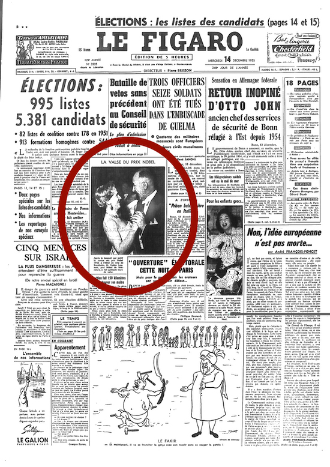

Title: „Vandfýsnasta bókmentaland heimsins“
Subtitle: Franskar þýðingar 1950-1970
Slug: vandfysnasta-bokmentaland-heimsins
Date: 2008-08-21 13:44:15
UID: 483
Part: 2/4
Lang: is
Author: Hanna Steinunn Þorleifsdóttir
Author URL: 
Category: Bókmenntafræði, Bókmenntir, Franska, Þýðingafræði
Tags: Franska, franskar bókmenntir, þýðingar, Bókmenntir, Alfred Jolivet, Maurice Gravier, Sorbonne, Sainte-Geneviève, Pétur Benediktsson, Halldór Laxness, Saga úr síldinni, Bertil Galland, Rödd af Íslandi, Þjóðviljinn, Ósigur ítalska loftflotans í Reykjavík 1933, Le Figaro, Halldór Guðmundsson, Le Figaro littéraire, Pierre Brisson, Hörður Ágústsson, Francois Mauriac, Marta Thors, Jóhannes Helgi, Jochum G. Eggertsson, Þórir Bergsson, Elínborg Lárusdóttir, Eimreiðin, 54 bestu smásögur heims, New York Herald Tribune, Universal Features, Eiríks saga rauða, Grænlendingaþáttur, Jean Graulier, Silfurtúnglið, Slaka Valka, Fuglinn í fjörunni, Slaka Valka Petite fille d'Islande, Du monde entier, Atómstöðin, Steingrímur J. Þorsteinsson, Háskóli Íslands, Alliance francaise, Régis Boyer, Jón Óskar, Birtingur, Pierre Teilhard de Chardin, Morgunblaðið, Hrafnkels saga, Pierre Halleux, Víga-Glúms saga, Hrafnkels saga Freysgoða, Auðunar þáttr vestfirzka, Gísla saga Súrssonar, Paradísarheimt, Einar Bragi

Latínan var millimálið sem keppst var við að þýða á fyrir fræðaheiminn fyrr á öldum og langt fram eftir 19. öld. Á 20. öld tekur alllangan tíma að ná því að Íslendingar eru enn vel skrifandi. Fáir ráða við íslenskuna í frönskumælandi löndum og þegar því er að skipta hafa fornbókmenntirnar forgang. Að skrifa á öðru máli en íslensku auðveldaði því óneitanlega þýðingar á fyrri helmingi aldarinnar.

Sambandinu við germanskar deildir í Frakklandi hafði lengi verið ábótavant og bókahallæri mikið. Íslenskan var kennd við Sorbonne en eins og prófessorinn, Alfred Jolivet, segir í viðtali haustið 1948 „af nútíma bókmentum er hjer sáralítið til. Þetta gerir alla kenslu í íslensku erfiðari en vera ætti.“[^1] Upp úr 1955 fór ástandið að batna því Maurice Gravier, sem þá var nýtekinn við af Jolivet við Sorbonne og átti sæti í stjórn Sainte-Geneviève-bókasafnsins, leitaði til Péturs Benediktssonar sendiherra og „hann kom því í kring að við fórum að fá bækur héðan frá Íslandi og síðan hafa safninu bætzt margar góðar ísl. bækur.“[^2]

Árið 1953 birtist frönsk þýðing á smásögu Halldórs Laxness „Saga úr síldinni“ í þekktu Parísartímariti og er hún eftir Bertil Galland.[^3] Einnig birtist grein í tímariti friðarsinna eftir Halldór, sem titluð er „Rödd af Íslandi“ í _Þjóðviljanum_.[^4] Þýðing á smásögunni „Ósigur ítalska loftflotans í Reykjavík 1933“ eftir Halldór fylgir með en þýðanda er hvergi getið.[^5]

Stórtíðindin gerast árið 1955. Halldór Laxness fær Nóbelsverðlaunin. Alfred Jolivet skrifaði fallega grein í _Le Figaro_, segir Halldór Guðmundsson í ævisögu Halldórs Laxness.[^6] Hið rétta er að greinin góða kom út í frægum bókmenntakálfi blaðsins, _Le Figaro littéraire_, 5. nóvember 1955, undir fyrirsögninni „Nóbelsverðlaunin til Íslands“ (Le Prix Nobel de littérature à l’Islande) á forsíðu en „Nóbelsverðlaunin til Laxness“ (Le Prix Nobel à Laxness) á baksíðu. Myndir af HKL eru hins vegar tvisvar á forsíðu _Le Figaro_.[^7] Haldið er hóf í salarkynnum _Le Figaro littéraire_ sem ritstjóri bókmenntablaðsins, Pierre Brisson, boðar til. Íslenskir Parísarstúdentar í bókmenntum og listum, íslenskir embættismenn, Maurice Gravier, forstöðumaður sænska stúdentagarðsins,[^8] Pétur Benediktsson sendiherra, Alfred Jolivet prófessor, Hörður Ágústsson listmálari og síðast en ekki síst franski Nóbelsverðlaunahafinn 1952, François Mauriac, frægur pistlahöfundur blaðsins, fagna í sameiningu verðlaununum og bókmenntaárangri þessa unga lýðveldis, eins og þar segir í myndatexta.[^9] Frú Benediktsson (Marta Ólafsdóttir Thors) og sendiherrann[^10] eru á spjalli við franska Nóbelshafann þegar myndin er tekin.

Nóbelsárið góða komu út fjórar íslenskar úrvalssmásögur á bók í París og sést á örnefnum að þær eru þýddar úr ensku en þýðenda er ekki getið. Smásögurnar eru eftir Jóhannes Helga, Jochum G. Eggertsson, Þórir Bergsson og Elínborgu Lárusdóttur og birtust þær sama ár í _Eimreiðinni_.[^11] Þetta eru allt smásögur sem komust í úrslit í smásagnasamkeppni sem blöð og tímarit í 18 löndum efndu til árið 1954. Titill bókarinnar er ekki af verra taginu, _54 bestu smásögur heims_.[^12] _New York Herald Tribune_ og _Universal Features_ veittu verðlaun og eru verðlaunasögurnar fremst í bókinni.

Nóbelsárið kemur einnig út þýðing Maurice Gravier á _Eiríks sögu rauða_ og _Grænlendingaþætti_.[^13] Ári síðar birtist frönsk þýðing Jean Graulier á _Silfurtúnglinu_ í tímariti.[^14] Halldór kemur árið 1956 til Parísar og reynast rithöfundarlaunin þegar til kemur heldur rýr en þýðandinn hafði þó fengið sitt.[^15] Alfred Jolivet kann vel að meta Kiljans bækurnar en ekki virðist hann hafa reynt við þýðinguna á seinni bók _Sölku Völku_ í millitíðinni því í viðtali við Íslandsheimsókn haustið 1947 talar hann um þýðinguna á _Sölku Völku_ eins og seinni bókin sé ekki til.[^16] Það gæti hins vegar verið frönsk kurteisi, að hann forðist þannig að lýsa því beinlínis yfir að hann hafi ekki hug á að þýða hana.[^17] Þess utan hefur viðfangsefnið ef til vill þótt erfitt í nýju samhengi því frönsk þýðing á _Fuglinum í fjörunni_ bíður enn. _Salka Valka. Petite fille d’Islande_ var hins vegar endurútgefin í heimsbókmenntaflokknum „Du monde entier“ árið 1956 af augljósum ástæðum. Ári síðar er _Atómstöðin_ þýdd úr dönsku.[^18] Það er sú þýðing sem gefin er út í Nóbelsritröðinni 1964 með grein um HKL eftir Steingrím J. Þorsteinsson í þýðingu Alfreds Jolivet. Líklega er _Atómstöðin_ valin því þýðingu á seinni bók _Sölku Völku_ vantaði þá sem nú.

Tvær greinar birtust í franskri þýðingu árið 1960, önnur um forna íslenska list eftir Kristján Eldjárn úr þýsku og hin um Íslendingasögurnar eftir Einar Ólaf Sveinsson í þýðingu Magnúsar G. Jónssonar.

Árið 1961 kemur ungur maður til Íslands sem hafði hrifist af Íslendingasögunum. Hann er 28 ára og heillast af birtu Norðursins.[^19] Þetta er nýi franski sendikennarinn sem kennir tvo vetur við Háskóla Íslands og Alliance française. Þessi ungi maður heitir Régis Boyer. Honum líður vel á Íslandi og heldur röð hálærðra fyrirlestra[^20] í húsakynnum Alliance française. Hann kynnir franska menningu ljúflega, m.a með ljóðalestri á skemmtikvöldum með íslenskum ljóðskáldum. Jón Óskar les t.d. eitt kvöldið úr þýðingum sínum á frönskum ljóðum og sendikennarinn ungi fer með þau á frönsku.[^21] Áður en Régis Boyer heldur til Svíþjóðar 1963 skrifar hann grein í _Birting_ um ?Pierre Teilhard de Chardin (1881-1955)[^22] og heilsíðugrein um franska háskóla sem birt var um haustið í sunnudagskálfi _Morgunblaðsins_.[^23]

Árið 1963 kemur _Hrafnkels saga_ út í franskri þýðingu Pierre Halleux.[^24] Ári síðar koma fyrstu miðaldaþýðingar Régis Boyer út í hefti, _Víga-Glúms saga_, _Hrafnkels saga Freysgoða_, _Auðunar þáttr vestfirzka _og _Gísla saga Súrssonar_.[^25] _Paradísarheimt_ kemur síðan út í franskri þýðingu 1966, en úr millimáli.[^26]

Það er eflaust engin tilviljun að fyrsta ljóðabókin sem kemur út hjá Helgafelli í þýðingu Régis Boyer, haustið 1967, er einmitt eftir Jón Óskar.[^27] „Það er skemmtilegt til þess að vita að ljóð Jóns koma einmitt út á frönsku – hann hefur sjálfur öðrum fremur stundað það að íslenzka frönsk skáld,“ segir í _Þjóðviljanum_ af því tilefni.[^28]

Næsta þýðing Régis Boyer er einnig ljóðabók. Hann er fyrstur til að þýða Einar Braga á erlent tungumál og kemur bókin út í París árið 1968.[^29] Í formála bókarinnar skrifar þýðandinn m.a.:

> Eins og árátta vorrar aldar krefst, hefur hinni íslenzku skáldakynslóð hans verið gefið ákveðið kennimerki: atómskáldin eru þau nefnd. En þetta heiti lýsir honum listavel. Hann beitir kunnáttusamlegri kenningatækni að hætti íslenzku fornskáldanna, þjálfuðu orðfæri, fáguðu, aflþrungnu, sannarlega atómísku. Hver mynd vekur röð annarra nýrra, fjölmörg tónsvið fléttast saman, hver flötur roðasteinsins kastar nýjum geislum eins langt og augað eygir. Hann nær þessum tökum vegna afar hnitmiðaðs máls, sem gerir ljóð hans allt annað en auðþýdd, og mætti það verða mér afsökun. Hér er samþjöppuð hugsun felld að mjög knöppu formi. Þá spretta undarleg hai-kai (japanskur ljóðháttur – þýð.), eins og „Þegar augun brustu í tunglskininu“ eða „Stef“.
>
> Í ljóðum hans er afl, máttug tilfinning sem haft er gott taumhald á, en brýzt öðru hverju ódulin fram í eftirlætis lofsöngum skáldsins: til lífsins sem er sterkara en dauðinn, til ástarinnar sem er uppspretta lífsins og ábyrgð; þá rís lofgjörðin um jörðina sem er harðbýl en góð, um hafið viðsjált en gjöfult, um konuna sem er ástmild og frjó. Eins og hjá Michaux, glæðir þessi skynjun á hinu jarðneska, sem ógnað er og þó svo lífvænt, hljóðlát ljóð Einars Braga björtum gleðihljómi: konan ung og elskuð ber líf undir brjósti, nóttin fellir fagnaðartár yfir að hafa alið hreinleika dagsins.
>
> Hreinleiki! Sá sem hefur aldrei séð Þingvelli í vetrarsól getur ekki ímyndað sér hvílíka dýpt þetta orð, hreinleiki, hefur í brjósti Íslendings. Menn hafa flekkað hann, því miður. Vígvélar hafa búizt um einhvers staðar á eynni. Hér stígur tónninn, og strengurinn hljóðar af kvöl: er hugsanlegt, að verið sé að syngja haustljóð á miðju vori? Menn þurfa að lesa ljóðið „Staka“ með aðgát og minnugir þess, að „eirrauða agnið“ er dollarinn en „lontan“ hin litla íslenzka þjóð. Síðan geta þeir velt fyrir sér, hver „öngulmaðurinn“ sé. En takið eftir, hve tjáningin heldur áfram að vera hófsöm, skírskotunin hulin: sterk veig og vel eimuð. Annars er ákæran víðtækari! Einar Bragi biður tröll að eiga alla þess yfirborðsglæstu, ólgandi og glamurkenndu „siðmenningu“. Sælla væri að deyja við álfaljóðin fögru...[^30]

Nóbelsskáldið hefur vinninginn á þessu tímabili hvað þýðingar varða eins og eðlilegt er. _Atómstöðin_ og _Paradísarheimt_, báðar þýddar úr millimáli, koma út 1957 og 1966, og ljóðabækurnar eftir Jón Óskar og Einar Braga, 1967 og 1968. Enn er hlutur millimála nokkur en Alfred Jolivet og Régis Boyer þýða báðir af íslensku. Náin samvinna við íslensk skáld er nýlunda sem veit á gott.

[^1]: _Morgunblaðið_ 4. nóvember 1948, bls. 9 (Viðtalið er tekið af V. St. í París).

[^2]: _Morgunblaðið_ 17. desember 1958, bls. 3 (Viðtal við Maurice Gravier sem flutti tvo fyrirlestra heima: annan á frönsku, „Albert Camus, prophète de l’Absurde“, og hinn á íslensku, „Nýir straumar í franskri leikritagerð“ _Morgunblaðið_ 10. desember, forsíða). Þá var ný bygging Norræna bókasafnsins að rísa við Sainte-Geneviève-bókasafnið.

[^3]: _La Nouvelle Revue française_, 36, 1. desember 1955, bls. 1068-80: „Le Hareng“.

[^4]: Halldór Guðmundsson, _Halldór Laxness, ævisaga_, Reykjavík, JPV útgáfa, 2004, bls. 573. Greinin, sem undirrituð rakst óvart á á landsbókasafni Frakka (BnF), ber heitið „Quand un étranger habite notre maison“ á frönsku og birtist í _La Défense de la Paix_, 25, júní 1953.

[^5]: „La défaite de la flotte aérienne fasciste à Reykjavík (Islande) en l’an de grâce 1933“.

[^6]: Halldór Guðmundsson, _Halldór Laxness, ævisaga_, Reykjavík, JPV útgáfa, 2004, bls. 603.

[^7]: _Le Figaro_ 28. október og 14. desember 1955. „L’Islandais Laxness prix Nobel de littérature“ (Íslendingurinn Laxness Nóbelsverðlaunahafi) er fyrirsögnin á grein sem fylgir í október bæði á forsíðu og baksíðu. Seinni myndin, sem nefnist „La Valse du Prix Nobel“ (Nóbelsvalsinn), er sérlega glaðleg, Laxness tekur valsinn ; einnig birtust greinar um verðlaunahafann í _L’Aurore_, _Combat_, _L’Express_, _La Revue de Paris_ og _L’Humanité_, samkvæmt formála Kjell Strömberg, menningarfulltrúa sænska sendiráðsins í París, að _Atómstöðinni_ í Nóbelsritröðinni, 51. bindi, 1964, bls. 15.

[^8]: Garðprófastur sænska húss stúdentagarðanna 1946-1956. Sjá viðtal við Maurice Gravier við fyrstu Íslandsheimsókn hans, m.a. í leit að íslenskum sendikennara, _Morgunblaðið_ 17. desember 1958, bls. 3, og vef stúdentagarðanna: http://www.ciup.fr.

[^9]: Samkvæmt myndatexta á baksíðu _Le Figaro littéraire_ 5. nóvember 1955.

[^10]: Samkvæmt æviágripi á alþingisvef, stundaði Pétur nám í Grenoble og Toulouse 1936-1937: http://www.althingi.is/altext/thingm/0812060009.html.

[^11]: _Róa sjómenn_, _Bláa huldan; álfkonan yndislega_, _Ástir og blóm_ og _Ástin er hégómi_, i alþjóðasmásögusamkeppninni 1954.

[^12]: _Les 54 meilleurs contes du monde_.

[^13]: _La Saga d’Éric le Rouge. Récit des Groenlandais_. Texte islandais avec introduction, traduction, notes et glossaire de Maurice Gravier. París, Éditions Montaigne, 1985.

[^14]: _Europe_, 131-2, nóvember-desember 1956, bls. 135-186: „La Berceuse vendue : drame en 4 actes, 6 tableaux“.

[^15]: Halldór Guðmundsson, _Halldór Laxness, ævisaga_, Reykjavík, JPV útgáfa, 2004, bls. 615, 622.

[^16]:  _Morgunblaðið_ 3. október 1947, bls. 9: „Og rjett áður en styrjöldin braust út þýddi jeg Sölku Völku Kiljans á frönsku. Þetta var á óhentugum tíma, en samt hefur upplagið nú selst.“ Þar segir hann einnig: „Vel gæti komið til mála að þýða t.d. bækur eftir Jón Trausta og svo Kiljans bækurnar, t.d. Íslandsklukkuna. Það eru skemmtilegar sögur“.

[^17]: Alfred Jolivet segist hafa lesið báðar bækur _Sölku Völku_ áður en hann hitti Halldór Laxness fyrst 1935 í grein sinni í _Le Figaro littéraire_ 5. nóvember 1955, forsíðu (en ekki 1933 eins og kemur fram í ævisögu HL, bls. 334-335; Sjá „Vandfýsnasta bókmentaland heimsins“ - Franskar þýðingar I (1900-1950) hugsandi.is 14. ágúst 2008, nmgr. 17).

[^18]: En ekki íslensku eins og stendur á forsíðu og kápu 1. útgáfunnar. Í Nóbelsritröðinni er þessu með íslenskuna enda sleppt.

[^19]: Régis Boyer, _Au nom du viking. Entretiens avec Jean-Noël Robert_. Paris, Les Belles Lettres, 2002; kaflinn „La lumière du Nord“, bls. 59-115.

[^20]: Samkvæmt auglýsingum Alliance française í _Morgunblaðinu_ voru viðfangsefnin m.a. „Humanisme contemporain“, „Surréalisme“, „Humanisme catholique“, „Existentialisme“,  „Jean Paul Sartre“,  „Humanisme personnaliste“,  „Le Rationalisme scientifique“ og að lokum „Conclusion générale : Contre la tentation de l’absurde et du gratuit“.

[^21]: _Morgunblaðið_ 31. maí 1963, bls. 11.

[^22]: _Birtingur_, 1963, 3.-4. hefti, bls. 16-26. Sigríður Magnúsdóttir þýddi.

[^23]: _Morgunblaðið_ sunnudaginn 13. október 1963 (223. tölublað II), bls. 10 og 14. 

[^24]: Pierre Halleux, _Aspects littéraires de la Saga de Hrafnkel. Étude accompagnée de texte islandais (édition de Jón Helgason) et d’une traduction française_. [Bibliothèque de la Faculté de Philosophie et Lettres de l’Université de Liège – Fascicule CLXIX]. Paris, Belles Lettres, 1963, bls. 77-133.

[^25]: _Trois sagas islandaises du XIIIe siècle et un tháttr. Introductions_, notes et traductions de Régis Boyer. Préface par J. Malaurie. Publications du Centre d’Études Arctiques. Contributions numéro 3. Paris 1964.

[^26]: _Le Paradis retrouvé_. Traduit de l’anglais par René Hilleret. París, Gallimard, 1966.

[^27]: _La Nuit sur nos épaules (Nóttin á herðum okkar)_. Reykjavík, Helgafell, 1967 (en ekki 1966). Sjá : _Þjóðviljann_ (baksíða) og _Morgunblaðið_ (bls. 5) 20. september 1967.

[^28]: _Þjóðviljinn_ 20. september 1967, baksíða.

[^29]: _Étangs clairs (Hreintjarnir)_. Paris, Éditions Sparre, 1968.

[^30]: _Þjóðviljinn_ laugardaginn 25. janúar 1969, bls. 7. Mjög líklega í íslenskri þýðingu Einars Braga sjálfs. Michaux; sjá: [http://www.franceweb.fr/poesie/michaux3.htm](http://www.franceweb.fr/poesie/michaux3.htm) og ljóðið „Vindurinn“ eftir Henri Michaux í þýðingu Einars Braga í _Gestaboð um nótt : ljóð_. Reykjavík 1953.
