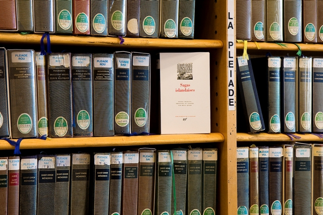

Title: „Vandfýsnasta bókmentaland heimsins“
Subtitle: Franskar þýðingar 1970-1987
Slug: vandfysnasta-bokmentaland-heimsins
Date: 2008-09-30 11:00:54
UID: 660
Part: 3/4
Lang: is
Author: Hanna Steinunn Þorleifsdóttir
Author URL: 
Category: Bókmenntir, Franska, Þýðingafræði
Tags: Sorbonne, Paul Verrier, Guðmundur Finnbogason, Alfred Jolivet, Fernand Mossé, Salka Valka, Laxdæla saga, Grettis saga, Collége de France, Dagmar Bjarnason, Paul-Isidore Verrier, Eddukvæði, Maurice Gravier, Nancy, París, Emil H. Eyjólfsson, Régis Boyer, Pierre Naert, Einar Benediktsson, Eiríks saga rauða, Völsungasaga, Hrafnkelssaga, Tómas Guðmundsson, Fagra veröld, Jón Trausti, Halldór Kiljan Laxness, Íslandsklukkan, Gestur Pálsson, Hænsna-Þóris saga, Pierre Halleux, Liege, Félix Wagner, Atlakviða, Béowulf, Nibelungen, Alan Marez, Bordeaux, Paradísarheimt, Einar Ólafur Sveinsson, Les Lettres Nouvelles, Paul Aebischer, Karlamagnús saga, Eyrbyggja, Pierre Renauld-Krantz, Stokkhólmur, Ósló, Njáls saga, Elínborg Stefánsdóttir, Gérard Chinotti, Kormáks saga, Frédéric Durand, Caen, Þorsteins þáttr stangarhöggs, Gerpla, Haraldar saga harðráða, Við heygarðhornið, Helgafell, Jóhann Hjálmarsson, Vatnsdæla saga, Annette Patron-Godefroit, Kaupmannahöfn, Jómsvíkinga saga, Ólafs saga helga, Færeyinga saga, Jean Renaud, Gunnars þáttr Þiðrandabana, Gísla þáttr Illugasonar, Tíminn og vatnið, Íslendingasögur, La Bibliotheque de la Pléiade, Steinn Steinarr

Prófessorarnir við Sorbonne sem höfðu áhuga á norrænum fræðum voru lengst framan af germanistar, Paul Verrier (1860-1938) var einn þeirra. Guðmundur Finnbogason (1873-1944) skrifar 1935 að hann hafi verið: „brautryðjandi í kenslu Norðurlandamála við Parísarháskólann“ og að „Hann er málamaður mikill, fjöllærður og hefir skrifað mikil og merkileg rit um enska og franska bragfræði. Hann er mjög vel að sjer í tungu vorri og bókmentum.“[^1] Þegar Guðmundur hittir þá Verrier, Mossé og Jolivet á stúdentagörðunum, þar sem eru einnig íbúðir fyrir prófessora, er sá síðastnefndi einmitt að þýða fyrri bók _Sölku Völku_. Eftir því sem næst verður komist liggja hvorki þýðingar úr íslensku né forníslensku eftir Verrier[^2] og ekki verður séð að hann hafi komið til Íslands en Fernard Mossé (1892-1956), sem þýddi tvær Íslendingasögur (_Laxdælu_ 1914, _Grettlu_ 1933) og kenndi síðar við Collège de France, var einn lærisveina hans. Verrier var góðvinur Guðmundar og meðal elstu vina Dagmar Bjarnason (1862-1940) en hún hafði komið til Parísar fyrir aldamótin.[^3] Um Paul-Isidore Verrier segir í minningargreinum í blöðum á Norðurlöndunum: „Minnast mörg þeirra á áhuga hans fyrir Íslandi og íslenskum fræðum og minna meðal annars á það, að fyrstu fyrirlestrar hans við Parísarháskóla hafi verið um _Eddukvæði_.“[^4] Alfred Jolivet tekur síðan við af Verrier árið 1930. Við lát Jolivet (1885-1966) í Skodsborg berast fréttir heim úr Hafnarblöðunum: „Blaðamenn töluðu um hann, með mikilli hrifningu, um lærdóm hans, fjör hans, áhuga á því að kynna norrænar bókmentir fyrir frönskumælandi þjóðum“.[^5] Alfred Jolivet dreymdi um betri bókakost Norræna bókasafnsins. Það vill svo til að erfingjar hans færðu safninu bókagjöf úr bókasafni hans árið 2001 og þar á meðal eru fjölmargar ágætar bækur á íslensku.[^6] Það er einstaklega glaðlegur maður sem tekur við af Jolivet árið 1955, Maurice Gravier.[^7] Hann hafði kennt við háskólann í Nancy og voru áhugasvið hans leiklist, leikhús og leikbókmenntir.[^8] Það var honum sem tókst m.a. að fá íslenskan sendikennara að Sorbonne.[^9] Emil H. Eyjólfsson hóf íslenskukennslu við Sorbonne 24 ára að aldri haustið 1959.[^10]

Þegar Régis Boyer hefur kennslu haustið 1970 við Sorbonne-háskóla IV, eftir nær tug ára í Norðrinu,[^11] eru norrænar bókmenntir enn höfugt leyndarmál germanista. Harla lítið er til af þýðingum úr íslensku eða norrænum málum yfirleitt sem gerir alla kennslu og kynningu norrænnar menningar í Frakklandi erfiða. Honum fallast hendur í fyrstu en síðan fyllist hann eldmóði.[^12] Til að ná til franska bókmenntaheimsins og um leið auka námsefni í norrænum fræðum við háskólann þarf að þýða yfir á frönsku vel valin bókmenntaverk og kynna þau. Með þverfaglegan bakgrunn leggur hann á brattann og fer, meðal svo margs annars, að þýða. Hann berst fyrir að koma hverri þýðingu út á bók en það gat tekið á og það gat tekið tíma en honum tekst það.[^13] Það er eflaust þennan kraft sem fyrirrennara hans skorti einna helst.

Alfred Jolivet og Pierre Naert tala báðir um þýðingar í viðtölum heima. Alfred Jolivet sem ku hafa verið hrifinn af kveðskap Einars Benediktssonar segir árið 1948: „Einn af nemendum mínum hefir nýlega þýtt _Eiríks sögu rauða_ og _Völsungasaga_ mun bráðum koma út í franskri þýðingu. Einnig á jeg von á að _Hrafnkelssaga_ komi út bráðum í þýðingu eftir Naert, er eitt sinn var hjer í Rvík. Hann þýddi líka nokkur kvæði Tómasar Guðmundssonar úr bók hans _Fagra veröld_. Eru það mjög sæmilegar þýðingar.“ Aðspurður hvort hann hafi áhuga á fleiri íslenskum skáldsögum til þýðingar, svarar hann: „Já. Vel gæti komið til mála að þýða t.d. bækur eftir Jón Trausta og svo Kiljans bækurnar, t.d. _Íslandsklukkuna_. Það eru skemmtilegar sögur. Jeg fyrir mitt leyti hefi lengi haft dálæti á sögum Gests Pálssonar.“[^14] Í viðtali ári síðar segist Pierre Naert vera búinn að þýða _Hrafnkels sögu_ og _Hænsa-Þóris sögu_ en að enginn fáist til að gefa þær út.[^15]

Af þeim fornsögum sem Jolivet og Naert nefna er aðeins ein, _Eiríks saga rauða_ í þýðingu Maurice Gravier, sem kemur út nokkru síðar (1955) og það vill svo til að hún kemur út í ritröð sem Alfred Jolivet sjálfur og Fernand Mossé höfðu stofnað til á stríðsárunum. _Hrafnkels saga_ kemur út tvisvar í París með stuttu millibili, árið 1963 í þýðingu Pierre Halleux (1921-1972),[^16] sem lærði í Liège, og ári síðar í þýðingu Régis Boyer, sem lærði í Nancy og síðar í París. _Völsunga sögu_ hafði Félix Wagner (1877-1957) þýtt árið 1929 og gæti það hafa hindrað útgáfu nýrrar þýðingar. Þegar útdrættir úr þýðingu Wagners á _Völsunga sögu_ og _Atlakviðu_ eru gefnir út árið 1958 ásamt útdráttum úr _Beówulf_ og _Nibelungen_ skrifar Alfred Jolivet eftirmála um skyldleika þessara verka en minnist ekki einu orði á nýrri þýðingu.[^17] Ekki verður séð að _Hænsna-Þóris saga_ hafi komið út fyrr en 1988 og þá í þýðingu Alain Marez, prófessors í Bordeaux.

Frönsk þýðing _Paradísarheimtar_ úr ensku árið 1966 reyndist vera ein sú síðasta úr millimáli.[^18] Þriðja ljóðabókin sem kemur út í franskri þýðingu af íslensku er eftir Einar Ólaf Sveinsson. Régis Boyer er í Uppsölum þegar hann þýðir hana.[^19] Ljóðabókin kom hins vegar út í Reykjavík 1972 og fékk góða umfjöllun ef marka má fjölmiðla.[^20] Hann bætir um betur og kynnir til leiks fleiri íslensk ljóðskáld í _Les Lettres Nouvelles_.[^21] Paul Aebischer (1897-1977), sem lengi hafði rannsakað _Karlamagnús sögu_, þýðir fyrsta part hennar árið 1972.[^22] Ári síðar kemur út þýðing Régis Boyer á _Eyrbyggju_,[^23] þá gott úrval úr Eddunum. Einstakt úrval eddukvæða og dróttkvæða, þ.á m. ófáar lausavísur, hafði birst árið 1964 í þýðingu Pierre Renauld-Krantz (1922-1979). Hann lærði ungur í Stokkhólmi og Ósló (1947-1949) og tekur sérstaklega fram á bókarkápu að hann hafi dvalið á Íslandi 1948.[^24] Fleiri fá hugmyndina um að þýða lengstu Íslendingasöguna, _Njálu_, því tvær þýðingar koma út sitt hvort árið, 1975 og 1976, önnur eftir Elínborgu Stefánsdóttur og Gérard Chinotti og hin eftir Régis Boyer.[^25] Þá kemur _Kormáks saga_ út í þýðingu Frédéric Durand, prófessors í Caen, árið 1975.[^26] Ári síðar kemur _Þorsteins þáttr stangarhöggs_ út í franskri þýðingu Régis Boyer.[^27]

Afköst Régis Boyer eru framvegis ótrúleg. _Gerpla_, _Íslandsklukkan_ og _Haraldar saga harðráða_ koma allar út í þýðingu hans árið 1979.[^28] Íslendingum verður svo mikið um að þeir veita honum Fálkaorðuna.[^29] Íslenskar bókmenntir eru loksins komnar á dagskrá í Frakklandi sem þýðir þó ekki að björninn sé unninn.

Árið 1980 kveður Régis Boyer dyra hjá Nóbelsskáldinu okkar. Hann hafði tekið að sér að vera spyrill fyrir franska útvarpið við upptökur á þáttaröð um Ísland og fær hann Halldór til að tjá sig um fornbókmenntirnar o.fl. Í ritdómi um bók Halldórs Laxness _Við heygarðshornið_, sem kom út hjá Helgafelli 1981, skrifar Jóhann Hjálmarsson: „Athuganir um fornbókmenntir, úr sendibréfi til prófessors Régis Boyer er fróðleg samantekt. Sama er að segja um Fransk-íslenskar orðræður milli próf. Régis Boyer og HL. Eins og áður er Halldóri í mun að benda á tengsl íslenskra fornhöfunda við Evrópu og hve lítið skandínavískir þeir voru, enda fátt að sækja þangað að hans mati.“[^30]

Sama ár kemur _Vatnsdæla_ út í þýðingu Régis Boyer og hluti _Karlamagnús sögu_ í franskri þýðingu Annette Patron-Godefroit kemur út í Kaupmannahöfn.[^31] _Jómsvíkinga saga_ kemur út árið 1982 og _Ólafs saga helga_ árið eftir, enn í þýðingu Régis Boyer.[^32] Árið 1983 kemur _Færeyinga saga_ út í þýðingu Jean Renaud og tveir þættir (_Gunnars þáttr Þiðrandabana_ og _Gísla þáttr Illugasonar_) í þýðingu Alain Marez. Régis Boyer þýðir _Tímann og vatnið_ árið 1984[^33] og úrval þjóðsagna, sem kemur út heima.[^34]

Nokkur ár líða án franskra þýðinga en á því er eðlileg skýring. Mikið stendur til. Úgáfa Íslendingasagna í paradís franskrar útgáfu, La Bibliothèque de la Pléiade, árið 1987 er tignarlegur áfangi.[^35] „Vitanlega hefði það ekki getað gerst nema fyrir einlægan áhuga, lærdóm og dugnað þessa ötula bókmenntamanns.“[^36] Við eigum þann heiður Régis Boyer að þakka. Framvegis er engan veginn hægt að ganga fram hjá bókmenntaarfi Íslendinga í Frakklandi. Útgáfur koma og fara en þessi bókaflokkur er svipaður eilífðinni, í stöðugri endurprentun.

Tímabilið 1970 til 1987 markast af umfangsmiklum þýðingum á miðaldabókmenntum. Nokkuð er um samtímaþýðingar á tímabilinu en nútímabókmenntir eru þó enn í miklum minnihluta. Ljóðabók Einars Ólafs Sveinssonar kemur út í franskri þýðingu Régis Boyer 1972, _Gerpla_ og _Íslandsklukkan_ 1979 og _Tíminn og vatnið_ 1984. Fróðlegir og næmir formálar fylgja öllum þýðingunum en einn sá fallegasti mælir fyrir ljóðabók Steins Steinarr. Þýðingar ljóðabókanna þriggja, sem komu út á árunum 1967 til 1972, hafði þýðandinn allar unnið í náinni samvinnu við höfundana, sem eru góðir vinir hans. Á þessu tímabili er Régis Boyer einn um að veita aðgang að íslenskum nútíðarbókmenntum í Frakklandi með þýðingum.

[^1]: _Lesbók Morgunblaðsins_; 25. júlí 1935, bls. 5.

[^2]: Paul Verrier _Le vers français : formes primitives, développement, diffusion_. Bindi III: _Adaptations germaniques_. Paris 1931-1932. Þriðja bindið í öndvegisriti hans um franska bragfræði og danskvæði er um áhrif á germanskan brag og þar eru íslenskar ljóðlínur m.a. þýddar hér og hvar.

[^3]: Dagmar hafði fylgt danskri hefðarfrú til Parísar frá Kaupmannahöfn 1891 og  „Varð hún brátt heimilishjúkrunarkona og nuddlæknir á mörgum auðugum og tignum heimilum í Parísarborg og mikilsmetinn heimilisvinur,“ eins og Guðmundur segir um hana í nokkrum minningarorðum, _Morgunblaðið_ 16. febrúar 1940, bls. 6.

[^4]: _Morgunblaðið_ 14. ágúst 1938, bls. 3.

[^5]: Sjá viðtal við Alfred Jolivet, _Morgunblaðið_ 3. október 1947, bls. 9, og _Morgunblaðið_ 4. nóvember 1948, bls. 9.

[^6]: „Dons : 617 volumes ; parmi eux, 500 titres édités entre 1850 et 1940 forment un ensemble de première importance. Il provient des héritiers d’Alfred Jolivet (1885-1966) (...) Ce don remarquable représente un apport considérable dans tous les domaines du fonds de la Bibliothèque Nordique. Il faut souligner, en particulier, la qualité et la rareté des titres en littérature islandaise.“ [http://www-bsg.univ-paris1.fr/bsg/rapport.pdf](http://www-bsg.univ-paris1.fr/bsg/rapport.pdf) ; bls. 43.

[^7]: Maurice Gravier skrifar um forvera sinn í starfi í upphafi apríl-júní-hefti nr. 2, Études Germaniques, 21, 1966.

[^8]: Sjá viðtal við Maurice Gravier, _Morgunblaðið_ 8. ágúst 1974, bls. 14. Það var hann sem nefndi einn kaflann „Le miracle islandais“ (íslenska kraftaverkið) í bók sinni _Les Scandinaves : histoire des peuples scandinaves. Épanouissement de leurs civilisations des origines à la Réforme_. París, Éditions Lidis/Turnhout, Brepols, 1984, bls. 355-380.

[^9]: Sjá viðtal við Maurice Gravier við fyrstu Íslandsheimsókn hans, _Morgunblaðið_ 17. desember 1958, bls. 3.

[^10]: Tal íslenskukennara erlendis: [http://www.arnastofnun.is/page/arnastofnun_al_tal_islenskukennara_erlendis](http://www.arnastofnun.is/page/arnastofnun_al_tal_islenskukennara_erlendis )

[^11]: Tvö skólaár í Reykjavík (1961-1963), eitt í Lundi (1963-1964) og sex í Uppsölum (1964-1970). Eftir doktorsvörn við Sorbonne í júní 1970 er Régis Boyer skipaður í kennslustöðu norrænar menningar við háskólann.

[^12]: Régis Boyer _Au nom du viking. Entretiens avec Jean-Noel Robert_. Paris, Les Belles Lettres, 2002, bls. 48-49.

[^13]: Þar sem Régis Boyer dagsetur nær undantekningarlaust formála að útgáfum er hægt að spá í þann tíma sem líður frá því að hann skrifar formála til þess að bókin kemur út. Formáli að _Eyrbyggju_ er skrifaður í desember 1971 (útgáfa 1973), formáli að _Njálu_ í nóvember 1974 (útgáfa 1976), formáli að _Gerplu_ í nóvember 1974 (útgáfa 1979), formáli að _Íslandsklukkunni_ í maí 1976 (útgáfa 1979), formáli að _Haraldar sögu harðráða_ í mars 1977 (útgáfa 1979), formáli að _Ólafs sögu helga_ í mars 1982 (útgáfa 1983). Meðaltalið er tvö ár, en eitt til fimm ár geta liðið frá skilum handrits að útgáfu.

[^14]: _Morgunblaðið_ 3. október 1947, bls. 9.

[^15]: _Morgunblaðið_ 13. júlí 1949, bls. 10.

[^16]: Pierre Halleux og Knud Togeby (1918-1974) áttu hugmyndina að útgáfu hluta Karlamagnús sögu á íslensku og frönsku sem kom út árið 1980. Þeir fórust báðir í bílslysi, annar 7. desember 1972 í Belgíu og hinn tveimur árum síðar ásamt konu sinni, 27. desember 1974 í Danmörku.

[^17]: Í ritröð frægra verka: _Les Écrivains célèbres. Œuvres, 9. bindi : Les épopées germaniques_. París 1958. Notice d’Alfred Jolivet, bls. 191-206.

[^18]: Ef frá eru skildar bækur Ólafs Jóhanns Ólafssonar sem báðar eru þýddar úr ensku (Fyrirgefning syndanna 1996 úr enskri þýðingu Bernards Scudder og Slóð fiðrildanna 2004 úr enskri þýðingu Victoriu Cribb).

[^19]: _Chant (Ljóð)_. Reykjavík, Þjóðsaga, 1972.

[^20]: _Morgunblaðið_ 9. júlí 1972, bls. 10, og 3. júlí 1974, bls. 2.

[^21]: Davíð Stefánsson frá Fagraskógi, Einar Bragi, EÓS, Guðmundur Böðvarsson, Hannes Pétursson, Hannes Sigfússon, Jón Óskar, Jón úr Vör, Sigfús Daðason, Snorra Hjartarson, Stefán Hörður Grímsson, Steinn Steinarr, Thor Vilhjálmsson og Þorsteinn frá Hamri. Les Lettres Nouvelles. Numéro spécial, déc. 1973 – janv. 1974 : Écrivains du Danemark, des Iles Féroé, d’Islande, de Norvège, présenté par C.-G. Bjurström.

[^22]: « Vie et chronique guerrière, mondaine et scandaleuse de Charlemagne et de sa cour » í Paul Aebischer _Textes norrois et littérature française du Moyen Âge. II. La première branche de la Karlamagnús saga. Traduction complète du texte norrois, précédée d'une introduction et suivie d'un index des noms propres cités_. Publications Romanes et Françaises CXVIII. Genève, Librairie Droz, 1972, bls. 93-139.

[^23]: _La saga de Snorri le Goði (Eyrbyggja saga)_. Paris, Aubier Montaigne, 1973.

[^24]: „Edda et textes eddiques“, Régis Boyer et Evelyne Lot-Falck _Les religions de l’Europe du Nord_. Paris, Fayard/Denoël 1974, bls. 1-609 ; Pierre Renauld-Krantz _Anthologie de la poésie nordique ancienne. Des origines à la fin du Moyen Age_. Paris, Gallimard/NRF, 1964.

[^25]: _La saga de Njall le Brûlé_. Traduit avec introduction, notes et index par Elínborg Stefánsdóttir et Gérard Chinotti. Paris, 10/18, 1975 ; _La saga de Njall le Brûlé_. Traduit et présenté par Régis Boyer. París, Aubier Montaigne 1976.

[^26]: Frédéric Durand _La saga de Kormak_. Introduction, traduction, notes, lexique, cartes et index. Collection viking vol. 1. Éditions Heimdal 1975. [á bókarkápu stendur : „Deux siècles avant _Tristan et Iseut_, une grande Histoire d’Amour au pays des Vikings“...].

[^27]: „Le Dit de Thorsteinn le bâtonné“, _Les Vikings et leur civilisation. Problèmes actuels_. Rapport scientifiques publiés sous la direction de Régis Boyer. EPHE, Bibliothèque arctique et antarctique 5. Paris, Mouton, 1976, bls. 127-132.

[^28]: _La saga des fiers-à-bras_. Traduit et présenté par Régis Boyer. Aix-en-Provence, Pandora, Domaine nordique, 1979 ; _La cloche d’Islande_. Introduction et traduction du roman par Régis Boyer. París, Aubier Montaigne, 1979 ; _La saga de Harald l’impitoyable. Tirée de la Heimskringla de Snorri Sturluson_. Traduite, présentée et annotée par Régis Boyer. París, Petite bibliothèque Payot, 1979. Tilviljun ræður því auðvitað að bækurnar þrjár koma út sama árið ; Régis Boyer skrifar formála að _Gerplu_ í nóvember 1974, formála _Íslandsklukkunnar_ í maí 1976 og formála _Haraldar sögu harðráða_ í mars 1977.

[^29]: _Morgunblaðið_ 13. desember 1979, bls. 10.

[^30]: _Morgunblaðið_, laugardaginn 14. nóvember 1981, bls. 18; „Fransk-íslenzkar orðræður. Halldór Laxnss svarar spurningum um íslenzkar bókmenntir.“ Orðræðurnar birtust í _Morgunblaðinu_ með leyfi HKL og Régis Boyer sunnudaginn 18. nóvember 1980, bls. 49-50; um vorið hafði einnig birst: „Halldór Laxness Athuganir um fornbókmenntirnar (úr sendibréfi til próf. Régis Boyer), “ _Lesbók Morgunblaðsins_, 29. mars 1980, bls. 2-4. Halldór Laxness _Við heygarðshornið_. Reykjavík, Helgafell, 1981, bls. 82-105.

[^31]: _La saga des chefs du Val au Lac. Vatnsdæla saga_. Traduite, présentés et annotée par Régis Boyer. París, Petite bibliothèque Payot, 1980 (Régis Boyer skrifar formálann í desember 1975); _Karlamagnús saga. Branches I, III, VII et IX_. Édition bilingue projetée par Knud Togeby et Pierre Halleux. Texte norrois édité par Agnete Loth. Traduction française par Annette Patron-Godefroit. Avec une étude par Povl Skårup. Kaupmannahöfn, DSL/Reitzels boghandel, 1980 [_Um Karlamagnús konung, Oddgeirs þáttr danska, Jórsalaferð, Af Vilhjálmi Korneis_].

[^32]: _Vikings de Jomsborg_. Traduit, présenté et annoté par Régis Boyer. Bayeux, Éditions Heimdal, 1982 ; _La saga de saint Óláf. Tirée de la Heimskringla de Snorri Sturluson_. Introduction, traduction et notes de Régis Boyer. Paris, Payot, 1983.

[^33]: Steinn Steinarr _Le temps et l’eau_. Poèmes présentés et traduits par Régis Boyer. Le Paradou, Actes Sud/L’Aire/UNESCO, 1984.

[^34]: _Contes populaires d’Islande_. Iceland Review 1984/Almenna bókafélagið 2001; fjölmargar endurprentanir, sú nýjasta 2007.

[^35]: _Les sagas islandaises_. Textes traduits, présentés et annotés par Régis Boyer. Paris, NRF Gallimard, La Bibliothèque de la Pléiade, 1987 [_Egils saga Skallagrímssonar, Eyrbyggja saga, Eiríks saga rauða, Grænlendinga saga, Grænlendinga þáttr, Laxdæla saga, Bolla þáttr, Gísla saga Súrssonar, Fóstbræðra saga, Hávarðar saga Ísfirðings, Grettis saga Ásmundarsonar, Vatnsdæla, Víga-Glúms saga, Svarfdæla saga, Hrafnkels saga Freysgoða og Njála_]. Grunntextar þýðinganna eru útgáfur þeirra í Íslenskum fornritum.

[^36]: Jón Óskar „Háskólakennari í París kynnir íslenskar bókmenntir. Nokkur orð um Régis Boyer.“ _Skírnir. Tímarit hins íslenska bókmenntafélags_. Reykjavík 1985 (159. ár), bls. 222.
