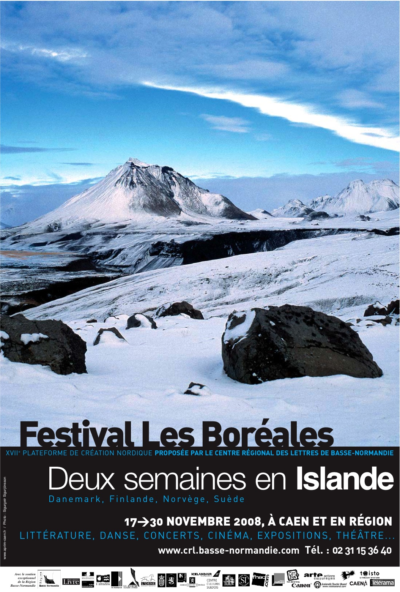

Title: „Vandfýsnasta bókmentaland heimsins“
Subtitle: Franskar þýðingar 1988-2008
Slug: vandfysnasta-bokmentaland-heimsins
Part: 4/4
Date: 2008-10-02 11:00:24
UID: 677
Lang: is
Author: Hanna Steinunn Þorleifsdóttir
Author URL: 
Category: Bókmenntir, Franska, Þýðingafræði
Tags: Régis Boyer, Frakkland, Norræna bókasafnið í París, Sorbonne-háskóli, Maurice Gravier, Eiríks saga rauða, Grænlendingaþáttur, Hrafnkels saga, Víga-Glúms saga, Gísla saga Súrssonar, Eyrbyggja, Caen-háskóli, Frédéric Durand, Kormáks saga, Jean Renaud, Færeyinga saga, Francois Émion, Eddukvæði, Landnáma, Heimsljós, Grámosinn glóir, Punktur punktur komma strik, Fóstbræður, Steinunn Le Breton Filippusdóttir, Endurkoma, Svava Jakobsdóttir, Tristrams saga Ísöndar, Daniel Lacroix, Lilja, Michel Taillé, Patrick Guelpa, Alain Marez, Bordeaux, Bandamanna saga, Ingeborg Cavalié, Ynglinga saga, Haraldar saga gráfeldar, Orkneyinga saga, Claude Lecouteux, Þiðrik frá Bern, Francois-Xavier Dillmann, École Pratique de Hautes Études, Snorra-Edda, Heimskringla, Gérard Lemarquis, María Gunnarsdóttir, Aðventa, Náttvíg, Ég heiti Ísbjörg ég er ljón, Catherine Eyjólfsson, Svanurinn, Englar alheimsins, Einar Már Jónsson, Konungs skuggsjá, Líkið í rauða bílnum, Ósögð orð, Norræn bókmenntasaga, Sturlunga saga, Morgunþula í stráum, Sjálfstætt fólk, Éric Boury, Riddarar Hringstigans, Skugga-Baldur, Arnaldur Indriðason, Þórarinn Eldjárn, Séverine Daucourt-Friðriksson, Ásdís R. Magnúsdóttir, Ragnars saga loðbrókar, Þór Stefánsson, Lucie Albertini, Um útlegð, Guðbergur Bergssn, Vegir Guðs, Fjalla-Eyvindur, Ragnheiður Ásgeirsdóttir, Nabil El Azan, Einar Benediktson, Handritaspegill, Jónas Kristjánsson, Sagan af bláa hnettinum, Stefán Hörður Grímsson, Píslarsaga síra Jóns Magnússonar, Robert Guillemette, Gérard Chinotti, Fransí biskví, Rígsþula, Henrý K. Albansson, Tröllakirkja, Menningarmálastofnun Sameinuðu þjóðanna í París, Bókmenntasjóður Frakka, Bókmenntakynningasjóður, Les Classiques du Nord, Les Belles Lettres, Vopnfirðinga saga, Geisli, Líknarbraut, Passíusálmar, Paradísarheimt, Íslandsklukkan, Gerpla, Péiade, Íslendingasögur, Halldór Laxness, Á meðan hann horfir á þig ertu María mey, Sólskinshestur, Brekkukotsannáll, Þorpið, Hrólfs saga kraka, Karítas án titils, Kleifarvatn, Með titrandi tár, Dauði trúðsins, Eftirmáli regndropanna, Les Boréales, Normandí

Tímabilinu 1988 til 2008 mætti skipta í tvennt, fyrir og eftir aldamótin 2000.[^1] Fram til aldamótanna eru miðaldabókmenntirnar ráðandi en upp úr því vinna íslenskar nútímabókmenntir eilítið á. Það er þó enn ekki auðhlaupið að því að kynna íslenska eða norræna menningu í Frakklandi. Régis Boyer þýðir úr öllum Norðurlandamálunum en hefur tekið sérstöku ástfóstri við íslenskuna, forna sem nýja. Hann er vinsæll fyrirlesari[^2] og notar hvert tækifæri til að koma norrænum bókmenntum á framfæri, kemur oftsinnis fram í útvarpi og sjónvarpi. Vikulegir viðtalstímar hans á Norræna bókasafninu á meðan hann var prófessor í norrænum fræðum við Sorbonne-háskóla voru sérlega dýrmætir. Þar vakti hann athygli á bókasafninu,[^3] veitti öllum viðtal sem eftir því sóttu og fékk vinnufrið það sem eftir var vikunnar. Þangað gátu allir áhugasamir um norræna menningu komið án þess að panta tíma og voru biðraðir ekki óalgengar. 

Þeir voru tveir prófessorarnir um að hlúa að norrænum málum við Sorbonne-háskóla í ein tíu ár eða þar til Maurice Gravier tók sér frí frá kennslu árið 1980. Gravier (1918-1992) hafði þýtt _Eiríks sögu rauða_ og _Grænlendingaþátt_ 1955 en látið þar við sitja. Fyrstu þýðingar Régis Boyer voru ljóðabækur en eldskírn miðaldaþýðinga voru _Hrafnkels saga_, _Víga-Glúms saga_ og _Gísla saga Súrssonar_ sem komu út í þýðingu hans árið 1964 og _Eyrbyggja_ einum tíu árum síðar.[^4] Nemendur prófessoranna við Sorbonne-háskóla hafa verið fjölmargir í gegnum árin og hafa margir þeirra látið að sér kveða, m.a. á þýðingarvellinum, sem og nemendur norrænudeildar Caen-háskóla, jafnvel þótt íslenskukennslan þar eigi sér ekki eins langa sögu.[^5] Kennarar við norrænudeildina í Caen hafa einnig þýtt nokkuð. Frédéric Durand þýðir _Kormáks sögu_ árið 1975 og tvær bækur af íslensku einum tuttugu árum síðar, Jean Renaud þýðir fyrst _Færeyinga sögu_ árið 1983 og er enn að. François Émion, núverandi forstöðumaður norrænudeildar Caen-háskóla, þýddi úr íslensku á árunum 1996-2003 og gæti vel hent að fleiri þýðingar komi út eftir hann.

Régis Boyer þýðir jöfnum höndum úr íslensku og forníslensku. Fyrir aldamót þýðir hann m.a _Eddukvæði_, _Landnámu_, _Heimsljós_, _Grámosinn glóir_, _Punktur punktur komma strik_ og _Fóstbræður_.[^6] Steinunn Le Breton Filippusdóttir þýðir smásöguna „Endurkoma“ eftir Svövu Jakobsdóttur. Tvær þýðingar á _Tristrams sögu Ísöndar_ koma út með stuttu millibili, önnur eftir Daniel Lacroix (1989) og hin eftir Régis Boyer (1995). Tvær þýðingar koma einnig út á _Lilju_, önnur eftir Michel Taillé (1989) en hin eftir Patrick Guelpa (2005). Alain Marez í Bordeaux þýðir tvær sögur, m.a. _Bandamanna sögu_,[^7] Ingeborg Cavalié _Ynglinga sögu_ (1990) og saman þýða þau _Haraldar sögu gráfeldar_ (1999). Jean Renaud, prófessor í Caen, heldur áfram að þýða úr forníslensku og þýðir m.a. _Orkneyinga sögu_.[^8] Claude Lecouteux rannsakar Þiðrik frá Bern og þýðir söguna (1995), sem er síðan gefin út sér árið 2001. Þá ber að nefna fyrstu þýðingar François-Xavier Dillmann, rannsóknaleiðbeinanda í École Pratique des Hautes Études,[^9] úr forníslensku, _Snorra-Eddu_ og fyrri hluta _Heimskringlu_.[^10] Fyrstu þýðingarnar koma einnig út eftir Gérard Lemarquis og Maríu Gunnarsdóttur, m.a. _Aðventa_,[^11] en eftir François Émion koma m.a. _Náttvíg_ og _Ég heiti Ísbjörg, ég er ljón_[^12] og Catherine Eyjólfsson þýðir m.a. _Svaninn_ og _Engla alheimsins_.[^13] Einar Már Jónsson þýðir _Konungs skuggsjá_ (1997) og síðustu þýðingar Frédéric Durand (1920-2002) koma út, _Líkið í rauða bílnum_ (1997) og _Ósögð orð_ (1998). Þá kemur _Norræna bókmenntasagan_ góða eftir Régis Boyer út árið 1996.[^14]

Eftir aldamótin 2000 jafnast hlutföllin og snúast jafnvel eilítið nútímabókmenntum í vil. Régis Boyer er afkastamikill sem fyrr og þýðir m.a. _Sturlungu_, _Morgunþulu í stráum_ og _Sjálfstætt fólk_.[^15] Þá kemur leiðarvísirinn um íslenskar miðaldir fyrst út árið 2001.[^16] Éric Boury lætur að sér kveða í þýðingum á nútímabókmenntum og þýðir m.a. _Riddara hringstigans_ og _Skugga-Baldur_.[^17] Hann kynnir til leiks íslenska krimma og nýtur Arnaldur Indriðason framvegis mikilla vinsælda í Frakklandi. Úrval smásagna Þórarins Eldjárns kemur út í þýðingu Séverine Daucourt-Friðriksson árið 2001. Eftir Ásdísi R. Magnúsdóttur koma út þýðingar á fjórum þáttum[^18] og eftir Jean Renaud koma fleiri þýðingar úr forníslensku, m.a. _Ragnars saga loðbrókar_.[^19] Saman þýða Ásdís og Jean síðan úrval þjóðsagna.[^20] Tvær ljóðabækur koma út með stuttu millibili með úrvali nútímaljóða, önnur í þýðingu Gérards Lemarquis (2001) og hin í þýðingu Þórs Stefánssonar og Lucie Albertini (2004). Catherine Eyjólfsson þýðir _Um útlegð_ eftir Guðberg og _Vegi Guðs_ eftir Einar Má (2001). _Fjalla-Eyvindur_ kemur út á bók í franskri þýðingu Ragnheiðar Ásgeirsdóttur og Nabil El Azan (2002) en þau hafa verið öflugir þýðendur íslenskra leikbókmennta á frönsku í gegnum árin. Patrick Guelpa skrifar um Einar Benediktsson og þýðir í leiðinni nokkur ljóð eftir hann (2003). Régis Boyer þýðir _Handritaspegil_ Jónasar Kristjánssonar (2003). Þá koma útdrættir úr íslenskum nútímabókmenntum út í kilju árið 2004.[^21] François Émion þýðir _Söguna af bláa hnettinum_ (2003), Einar Már Jónsson _Píslarsögu síra Jóns Magnússonar_ (2004), Robert Guillemette og Gérard Chinotti _Fransí biskví. Franskir Íslandssjómenn_ (2005),[^22] François-Xavier Dillmann _Rígsþulu_ (2006) og Henrý K. Albansson _Tröllakirkju_ (2007). 

Athyglisvert er að kanna hverjir styðja við útgáfu þýðinga í Frakklandi. Menningarmálastofnun Sameinuðu þjóðanna í París lagði nokkrum sinnum lið á árunum 1964-2004.[^23] Allt frá 1979 hefur Bókmenntasjóður Frakka veitt mikilvæga þýðingarstyrki til útgáfu íslenskra bókmennta í franskri þýðingu.[^24] Bókmenntakynningarsjóður virðist í fyrstu hafa haft lítið fé til skiptanna og ver hann því einna helst til þýðinga á kynningarefni. Hlutverk hans virðist skerpast með árunum og hann veitir styrki til franskra þýðinga fyrst 1988 og 1989. Sjóðurinn veitir síðan styrki jafnt og þétt í gegnum árin til þýðinga ljóða, leikrita og skáldsagna á frönsku allt til 2006.[^25] Þess má geta að beinlínis var blásið til norrænu lista- og bókmenntahátíðarinnar í Caen árið 1992 til að kynna norrænar bókmenntir í Frakklandi. Nokkrar bækur voru gefnar út í tilefni hátíðarinnar, einkum á árunum 1996-2001.[^26] Oftar en ekki leggjast margir sjóðir á eitt um að styrkja franskar þýðingar á íslenskum bókmenntum og menntamálaráðuneytið hleypur einstaka sinnum undir bagga.

Hafin var útgáfa árið 2003 í ritröðinni Les Classiques du Nord (klassískar norrænar bókmenntir), sem Régis Boyer stýrir, hjá hinu þekkta forlagi Les Belles Lettres og hafa nokkrar íslenskar bækur komið þar út, s.s. _Sturlunga_, _Vopnfirðinga saga_, _Píslarsaga síra Jóns Magnússonar_, _Geisli_, _Líknarbraut_ og _Passíusálmarnir_.[^27] Þýðingar á íslenskum bókmenntum dreifast annars á öll helstu forlög Frakklands jafnvel þótt ekkert sé auðgefið í þeim efnum.[^28]

Eitt er að koma íslenskum bókum út, annað að halda þeim á markaði. Vandaðar kiljur eru vinsælar í Frakklandi og er þeim bókum sem þangað rata yfirleitt borgið. Einstaka þýðing úr íslensku hefur komið út í kilju, s.s. _Englar alheimsins_, _Paradísarheimt_, _Íslandsklukkan_, _Gísla saga Súrssonar_ og _Aðventa_. _Fóstbræður_, sem gefnir voru út í þýðingu Régis Boyer árið 2000, fást enn á fullu verði, sem og _Gerpla_, enda endurútgefin í hitteðfyrra, og _Sjálfstætt fólk_ sem er nýkomin úr endurprentun. Annars eru endurútgáfur íslenskra bóka í franskri þýðingu ekki algengar. Útgáfurnar á _Eddukvæðum_ (Régis Boyer) og _Snorra-Eddu_ (François-Xavier Dillmann) seljast ágætlega og hafa þær báðar verið endurútgefnar oftar en einu sinni, síðast í fyrra. Íslendingasögurnar í Pléiade-útgáfunni verða alltaf til. Flestar þær íslensku bækur sem gefnar voru út fyrir aldamótin síðustu eru þó nær ófáanlegar, þ.e. aðrar en bækur Nóbelsskáldsins. Þýðingalistanum á vef háskólans í Caen er ætlað að vekja athygli á frönskum þýðingum íslenskra verka[^29] en það þarf vart að taka það fram að vinsældir Arnaldar Indriðasonar vekja sjálfkrafa áhuga á íslenskum bókmenntum yfirleitt sem gæti orðið til þess að eldri þýðingar fari í endurprentun.

Þýðingarstarfsemin er orðin nokkuð blómleg en verkefnin að sama skapi óþrjótandi. Enn hefur verið nauðsynlegt að fylla upp í gapandi eyður, sem þýðir að langt er oft á milli ritunartíma og þýðingar, og samtímis að kynna nútímabókmenntir, sem færir þýðingarnar aftur nær ritunartíma. Umfjöllun um íslenskar bókmenntir hefur einnig verið ómissandi þáttur í kynningu íslenskra eða norrænna bókmennta almennt. Með þrotlausri vinnu mikið til eins manns er grundvöllurinn lagður og þó hefur hér aðeins[^30] verið drepið á þýðingarstarfsemi Régis Boyer úr íslensku, fornri sem nýrri.

Síðastliðinn áratug hefur þýðendum góðu heilli fjölgað nokkuð og franskar þýðingar á íslenskum nútímabókmenntum um leið aukist til muna en þær eru þó óvenjumargar í ár. Patrick Guelpa hefur í ár þýtt _Geisla_, _Líknarbraut_ og _Passíusálmana_, Catherine Eyjólfsson _Á meðan hann horfir á þig ertu María mey_ og _Sólskinshest_, Régis Boyer _Brekkukotsannál_, _Þorpið_ og _Hrólfs sögu kraka_, Henrý K. Albansson _Karítas án titils_ og Éric Boury _Kleifarvatn_, _Með titrandi tár_, _Dauða trúðsins_ og _Eftirmála regndropanna_.

_Les Boréales_, norræna lista- og bókmenntahátíðin í Normandí, var helguð Íslandi síðast árið 1996. Hún verður það á ný nú í haust þegar hátíðin[^31] verður haldin í 17. sinn og verður af því tilefni blásið til málþings um áhrif Íslands á ímyndunarafl ókunnugra í Caen-háskóla.[^32] Þónokkrir íslenskir rithöfundar hafa mætt á bókmenntahátíðir í Frakklandi síðustu ár og fjölmargir hafa komið til Caen í gegnum tíðina, margir hverjir oftar en einu sinni. Í ár er enn von á íslenskum rithöfundum til Normandí. Bækur þeirra íslenskra rithöfunda sem mest er hampað erlendis finnast ef til vill ekki mikið lengur í þeim örfáu bókabúðum sem enn eru til á Íslandi en þær rata þá kannski í þær frönsku.

[^1]: Neðanmálsgreinar geta verið skemmtilegar en til að forðast mýgrút tæknilegra neðanmálsgreina er bent á þýðingalistann á vef háskólans í Caen: [http://www.unicaen.fr/traductionsISLANDAIS](http://www.unicaen.fr/traductionsISLANDAIS)

[^2]: Hann heldur m.a. fyrirlestra á Les Boréales hátíðinni við miklar vinsældir. Þess má geta að hann kemur tvisvar vegna Íslandsdagskrárinnar í nóvember og tekur sömuleiðis þátt í málþinginu í Caen-háskóla.

[^3]: Þetta var í tíð Hedvig Vincenot bókavarðar Norræna bókasafnsins 1984-2000: [http://www-bsg.univ-paris1.fr/nordique/conservateurs.htm](http://www-bsg.univ-paris1.fr/nordique/conservateurs.htm). Régis Boyer tók sér frí frá kennslu við Sorbonne-háskóla árið 2001.

[^4]: Þýðingin kom út í 24. og síðasta bindi sömu ritraðar og _Eiríks saga rauða_.

[^5]: Um sögu norrænudeildar Caen-háskóla, sjá: _Au fil du temps... Témoignages de cinquante ans d’études nordiques à l’université de Caen_. Recueil publié sous la direction de Jean Renaud. Caen, Presses universitaires de Caen, 2006. Caen er höfuðborg Neðra-Normandí (Basse-Normandie) og Rúðuborg Efra-Normandí (Haute-Normandie). Þess skal getið að aðeins eru tvær norrænudeildir eftir í Frakklandi, í París og í Caen.

[^6]: _Hervarar saga og Heiðreks konungs_, _Kristnihald undir jökli_ (1988), _Heimsljós_, _Völsunga saga_ í nýrri þýðingu í tilefni af stúdíu á _Sigurði Fáfnisbana_ (1989; endurprentun 2008), _Grámosinn glóir_ (1991), _Eddukvæði_ (fyrstu þýðingar hans á kvæðunum voru gefnar út 1974), _Ólafs saga Tryggvasonar_ (1992), úrval ljóða eftir Sigurð Pálsson (1993), _Tímaþjófurinn_ (1995), _Gautreks saga_, _Hrólfs saga Gautrekssona_, _Hringsól_, úrval ljóða eftir Stefán Hörð Grímsson (1996), _Punktur punktur komma strik_, _Gunnlaugs saga Ormstungu_ og _Hallfreðar saga vandræðaskálds_ (1998), _Landnáma_ (valdir útdrættir birtust fyrst 1974), _Les sagas miniatures_ (38 þættir), _Fóstbræður_ (2000).

[^7]: _Hænsna-Þóris saga_ (1988) og _Bandamanna saga_ (1989).

[^8]: _Orkneyinga saga_ (1990) og _Bósa saga og Herrauðs_ (1993).

[^9]: Titlar kennara í hinum víðfræga skóla, École Pratique des Hautes Études (EPHE), eru nokkuð aðrir en í háskólakerfinu; kennarar eru titlaðir „leiðbeinendur rannsókna“ (Directeurs d’études). Sérsvið Dillmanns er: „Histoire et philologie de la Scandinavie ancienne et médiévale“ (Saga og fílólógía Skandínavíu til forna). Sjá : [http://www.ephe.sorbonne.fr/](http://www.ephe.sorbonne.fr/)

[^10]: _Snorra-Edda_ (1991: _Gylfaginning_ og hluti _Skáldskaparmála_) og fyrri hluti _Heimskringlu_ (2000: _Prologus_, _Ynglinga saga_, _Hálfdanar saga svarta_, _Haraldar saga hárfagra_, _Hákonar saga góða_, _Haraldar saga gráfeldar_ og _Ólafs saga Tryggvasonar_).

[^11]: Endurþýðing á _Svarfugli_ (1992) og þýðing á _Aðventu_ (1993) ; úrval úr _Eddukvæðum_ í þýðingu Gérard Lemarquis var síðan gefið út heima (1997).

[^12]: _Náttvíg_, _Ég heiti Ísbjörg, ég er ljón_ (1996), _Heimskra mann ráð_, _Hjartastaður_ (2000).

[^13]: _Svanurinn_ (1996), _Englar alheimsins_ (1998), úrval ljóða eftir Sjón (2000).

[^14]: Régis Boyer _Histoire des littératures scandinaves_. Paris, Fayard, 1996.

[^15]: _Morgunþula í stráum_ kemur út árið sem Régis Boyer tekur sér frí frá kennslu (2001), _Gunnlaðarsaga_ (2002), _Brotahöfuð_ (2003), _Sjálfstætt fólk_ (endurprentun 2008), ljóðabókin _Þú sem hlustar_, _Göngu-Hrólfs saga_ (2004), _Sturlunga saga_ (2005), _Bárðar saga Snæfellsáss_, _Harðar saga og Hólmverja_ (2007).

[^16]: Régis Boyer _L’Islande médiévale_. París, Les Belles Lettres, Collection Guide Belles Lettres des Civilisations, 2001, 2. prentun 2002.

[^17]: _101 Rvík_ (2002), _Elskan mín ég dey_ (2003), _Mýrin_ (2005), _Grafarþögn_ (2006), _Röddin_, _Tími nornarinnar_, _Riddarar hringstigans_, _Skugga-Baldur_ (2007), _Kleifarvatn_, _Krosstré_ (2008).

[^18]: _Helga þáttur Þórissonar_, _Þorsteins þáttur bæjarmagns_, _Sturlaugs saga starfsama_, _Egils saga einhenda_ og _Ásmundar berserkjabana_ (2002).

[^19]: _Vopnfirðingasaga_, _Þórðar saga hreðu_ (2003), _Ragnars saga loðbrókar_, _Þáttur af Ragnarssonum_ (2005).

[^20]: _La géante dans la barque de pierre et autres contes d'Islande collecté par Jón Árnason_. Traduits et édités par Ásdís Magnúsdóttir et Jean Renaud. París, José Corti, 2003.

[^21]: Með þýðingum eftir Catherine Eyjólfsson, Gérard Lemarquis, Nabil El Azan, Ragnheiði Ásgeirsdóttur, Etienne Marest og Robert Guillemette.

[^22]: Elín Pálmadóttir _Les Pêcheurs français en Islande. Trois siècles de campagnes : mythes et réalités_. Reykjavík, Mál og menning, 2005.

[^23]: Collection UNESCO d’oeuvres représentatives. Série européenne : Úrval eddu- og dróttkvæða í þýðingu Pierre Renauld-Krantz (1964), _Íslandsklukkan_ (1979), _Tíminn og vatnið_ (1984), _Heimsljós_ (1989), úrval úr kvæðum Stefáns Harðar Grímssonar (1996) og _Sjálfstætt fólk_ (2004) í þýðingu Régis Boyer.

[^24]: Það er skylt að taka fram að bókin hafi notið stuðnings Bókmenntasjóðs Frakka (CNL) á titilsíðum.

[^25]: Ég vil þakka Ástu A. Ingólfsdóttur menntamálaráðuneyti og Jóni Torfasyni Þjóðskjalasafni Íslands fyrir upplýsingar um Bókmenntakynningarsjóð.

[^26]: Ljóðúrval eftir Stefán Hörð Grímsson (1996), _Ég heiti Ísbjörg, ég er ljón_ eftir Vigdísi Grímsdóttur (1996), _Líkið í rauða bílnum_ eftir Ólaf Hauk Símonarson (1997), _Ósögð orð_ eftir Kristjönu Sigmundsdóttur (1998), norrænt smásagnasafn með smásögum eftir Guðrúnu Evu Mínervudóttur (2001).

[^27]: Sjá: [http://www.lesbelleslettres.com/collections/?collection_id=48](http://www.lesbelleslettres.com/collections/?collection_id=48)

[^28]: Svo sem: Gallimard, Aubier Montaigne, Les Belles Lettres, Fayard, Actes Sud, Payot, Anacharsis, Seuil, Arléa, Flammarion, L’Harmattan, Joseph K., Denoël, José Corti, Le Cavalier bleu, og hin síðari ár Éditions Métailié og Éditions Gaïa. Nýverið hafa Zulma, Rivages og Éditions Héloïse d'Ormesson bæst í hópinn.

[^29]: [http://www.unicaen.fr/traductionsISLANDAIS](http://www.unicaen.fr/traductionsISLANDAIS)

[^30]: Tvívegis hafa greinasöfn verið gefin út til heiðurs Régis Boyer: _Hugur. Mélanges d’histoire, de littérature et de mythologie. Mélanges offert à Régis Boyer pour son 65 anniversaire_. Presses universitaires de la Sorbonne Nourvelle, 1997, og  _Le secret d’Odin. Mélanges offert à Régis Boyer_. Presses universitaires du Nancy, 2001. Þá er vert að geta þess að málþing var haldið í Reykjavík 20. september 1997 til heiðurs Régis Boyer: „Trúarlíf á Sturlungaöld“: Morgunblaðið 18. september 1997, bls. 26: „Mörgum er kunnugt um hve mikilvægu hlutverki Régis Boyer hefur gegnt við að kynna íslenskar bókmenntir, fornar og nýjar, í Frakklandi og frönskumælandi löndum. Færri þekkja framlag hans til fræðilegrar umræðu um norræna menningu á miðöldum.“ Útdráttur úr fréttatilkynningu vegna málþingsins. Sjá einnig viðtal við RB _Lesbók Morgunblaðsins_ 20. september 1997, bls. 17.

[^31]: Vefur Les Boréales: [http://www.crl.basse-normandie.com/0-actu/boreales-2008/009.html](http://www.crl.basse-normandie.com/0-actu/boreales-2008/009.html) Þess má kannski geta að hátíðin fæddist í norrænudeild Caen-háskóla 1992 og var haldin fyrstu sjö árin (1992-1998) undir forystu Érics Eydoux, sem kenndi þá við deildina. Hann var menningarfulltrúi Caen-borgar fram að síðustu kosningum en stýrir nú Dior-safninu í Granville [http://www.ouest-france.fr/2008/06/14/granville/eric-Eydoux-dirige-la-Villa-Dior--53878657.html](http://www.ouest-france.fr/2008/06/14/granville/eric-Eydoux-dirige-la-Villa-Dior--53878657.html). Hátíðin hefur borið heitið „Les Boréales“ frá upphafi en með blæbrigðum þó:„Les Boréales, festival d’art et de littérature nordique“ fram til 2003 og „Festival Les Boréales, plateforme de création nordique“ síðan 2004.

[^32]: Vefur rannsóknarhópsins ERLIS, Caen-háskóla: [http://www.unicaen.fr/recherche/mrsh/erlis/807](http://www.unicaen.fr/recherche/mrsh/erlis/807)
