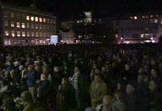
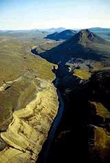

Title: Vantaði bara leiðtoga?
Slug: vantadi-bara-leidtoga
Date: 2006-09-27 02:44:00
UID: 96
Lang: is
Author: Helga Tryggvadóttir
Author URL: 
Category: Í umræðunni
Tags: 

Í gærkvöldi, þann 26. september, söfnuðust einhvers staðar á bilinu 8.000-15.000 manns saman í miðbæ Reykjavíkur til að mótmæla virkjunar- framkvæmdum við Kárahnjúka. Mörgum myndi finnast það seint í rassinn gripið þar sem til stendur að byrja að hleypa vatni í Hálsalón tveimur dögum síðar. Hvers vegna er fólk tilbúið að mótmæla framkvæmdunum nú þegar það virðist vera orðið of seint? 

Fjölmörg mótmæli gegn Kárahnjúkavirkjun og álveri í Reyðarfirði voru haldin áður en framkvæmdir hófust á svæðinu. Til að mynda voru dagleg mótmæli með ýmsum uppákomum haldin á mánaðarbili haustið 2002. Þar þótti gott ef um 50-60 manns mættu daglega. Um 400 athugasemdir gegn Kárahnjúkavirkjun bárust skipulagsstofnun sem er óvenjulega mikið magn. Skipulagsstofnun lagðist svo gegn Kárahnjúkavirkjun, en úrskurður hennar var felldur úr gildi gegn því að vissum skilyrðum um umhverfisvernd væri uppfyllt[^1]. Þegar á þessu gekk voru samt ekki haldin jafn fjölmenn mótmæli og í gær.

Eftir að framkvæmdir hófust voru tjaldbúðir reistar á Kárahnjúkasvæðinu til að mótmæla þeim. Eins var haldin ganga á vegum Íslandsvina í vor, þar sem mættu um nokkur þúsund manns. Athygli vekur þó að fjölmiðlaumfjöllun um þessi mótmæli var jafnan fremur neikvæð. Fréttir sem bárust frá Kárahnjúkasvæðinu voru aðallega af fólki sem hlekkjaði sig við vinnuvélar eða réðst inn á verkfræðistofur. Fréttir af Íslandsvinagöngunni snerust aðallega um nokkra einstaklinga sem töldu sig vilja sjá fyrrverandi iðnaðarráðherra drekkt, ef slagorð þeirra skulu túlkuð bókstaflega. 

Á meðan á þessu stóð heyrðust fremur neikvæðar raddir í samfélaginu gegn mótmælendunum. Ekki síst gagnvart erlendu mótmælendunum. Var þar um að ræða þjóðernishyggju, þar sem okkur fannst það ekki koma þeim við hvernig og hvort við nýttum landið okkar? Eða voru þeir kannski helst til rótttækir fyrir íslenskan mælikvarða? Þær raddir heyrðust líka, og þá bæði frá fylgjendum og andstæðingum virkjunarinnar, að það væri orðið of seint að mótmæla framkvæmdunum þar sem þær væru nú þegar komnar á fullt skrið. Það viðhorf heyrðist hjá mörgum virkjunar- andstæðingum að margir mótmælendanna gengju of langt. Þeir hefðu ekki áhuga á því að vera dregnir í dilka með „atvinnumótmælendunum“ líkt og öfgamenn væru. Höfðu rótttæku mótmælendurnir þau áhrif að fæla hinn almenna virkjunarandstæðing frá því að mótmæla henni eða höfðu þau áhrif í þá átt að draga almenningsálitið lengra út á jaðarinn?

Hvernig stendur þá á því að núna, þegar stíflan er tilbúin, nenna 11.000- 15.000 manns að þvælast niður í bæ til að mótmæla? Þegar allt virðist um seinan. Er það vegna þess að það vantaði áður leiðtoga til þess að sameina „atvinnu- mótmælendurna“ og hinn almenna borgara? Er fólk núna tilbúið fyrir mótmæli sem það var ekki reiðubúið fyrir 2002? Eða er ástæðuna fyrir fjöldanum nú ef til vill að finna í því að þessi mótmæli voru mun betur kynnt en þau fyrri?

Undanfarið hefur umræðan um Kárahnjúkavirkjun verið mjög áberandi í fjölmiðlum. Bæði með _Draumalandinu-Sjálfshjálparbók_ handa hræddri þjóð eftir Andra Snæ Magnason, og með tíðum greinum, m.a í _Lesbók Morgunblaðsins_, þar sem svæðinu sem fara á undir vatn hefur verið lýst á hjartnæman hátt. Flugferðir Ómars Ragnarssonar um svæðið hafa líka fært þetta torsótta svæði inn í stofu til fólks. Því er eru margir ef til vill farnir að sjá fegurðina í svæði sem það áður vissi ekki af, eða töldu vera einungis urð og grjót. 

Eins hefur umræðan breyst að því leyti að hún er ekki eins svart-hvít og hún var. Fyrir nokkrum árum var umræðan á þá leið að annað hvort væri maður fylgjandi atvinnuuppbyggingu á Austurlandi, og þá um leið fylgjandi virkjunum og álveri, eða þá að maður væri á móti hvoru tveggja. Nú er umræða um að virkjun og álver séu ekki eina lausnin fyrir Austfirðinga orðin almennari. Ómar hefur líka bent á möguleikann á því að láta virkjunina standa ónotaða en afla rafmagns fyrir álverið á annan hátt. Þá væri Kárahnjúkastífla stærsta atvinnubótavinna samtímans, á tímum þar sem ekki var þörf á henni. Það þyrfti nú líklega eitthvað mikið til að fallið væri frá svo dýrri framkvæmd þegar henni er lokið. 

Efasemdir um að stíflan sé nógu traust hafa látið á sér kræla og vakið upp spurningar um hvort stjórnvöld hafi verið full fljótfær þegar bygging stíflunnar hófst. Allt eru þetta hugsanlegar skýringar á því hvers vegna fólk er tilbúið að mótmæla virkjuninni núna en ekki fyrir byggingu hennar. 

Svo er líka möguleiki á því að ástæðan fyrir mótmælunum nú sé sú að fólk hafi einfaldlega vantað einhvern leiðtoga til að sameinast um, sem kemur nú fram í Ómari Ragnarssyni. Hann er ekki þekktur fyrir öfgar og er langt frá því að bera á höfði sér dredda. Í ávarpi hans á Austurvelli í gærkvöldi notaði hann orðræðu þjóðernishyggjunnar til að sameina Íslendinga gegn fyllingu lónsins, að við þyrftum að berjast fyrir landi okkar, að stríðinu væri ekki lokið og að Íslendingar bæru ábyrgð á því að vernda landið fyrir komandi kynslóðir. Vísanir í fjallkonuna og ættjarðarást er mjög sterkt sameiningartákn, trúlega mun sterkara en vísanir í Kyoto-bókunina. En eins og Guðmundur Hálfdanarson bendir á í _Morgunblaðinu_ þann 10.september s.l þá er einnig að finna mikla þjóðernishyggju í málflutningi virkjanasinna. Þeir halda því fram að nýta beri auðlindir landsins fyrir þjóðina.

Í tengslum við þessa umræðu væri athyglisvert að skoða betur viðhorf Íslendinga til mótmæla og mótmælenda. Almennt séð hef ég á tilfinningunni að Íslendingar álíti mótmæli fremur tilgangslaus þar sem lítið sé hlustað á þau. Hvort það hefði haft einhver áhrif á stefnu stjórnvalda ef fleiri hefðu mótmælt áður en framkvæmdarleyfi var gefið fær enginn að vita. 

Er fólk fyrst núna að vakna til vitundar um þetta svæði og að það sé að verða of seint að bjarga því? Eða voru það bara þeir sem voru alltaf á móti framkvæmdinni sem töltu niður í bæ og hlustuðu á Ómar? Hann vill meina að það sé enn tími til stefnu til að hætta við, eða þar til jökulaurinn fer að safnast í lónið. Því sé hugsanlega meiri tími til stefnu en fram á fimmtudag. Þó telja verði það einstaklega ólíklegt að hætt verði við að fylla lónið úr því sem komið er þá hafa þessar þúsundir sem söfnuðust saman í miðbænum þó að minnsta kosti lýst yfir skoðun sinni. Og hver veit nema að þetta kunni að hafa áhrif á náttúruvernd og auðlindanýtingu í framtíðinni.

[^1]: Sjá á: http://www.halendid.is/Halendi/index.htm

