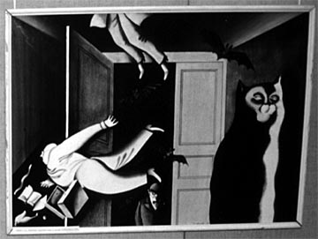
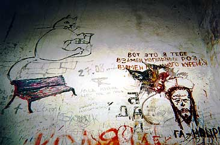

Title: Veggjakrot í Moskvu.
Slug: veggjakrot-i-moskvu
Date: 2007-10-09 13:17:00
UID: 185
Lang: is
Author: Hafdís Hafsteinsdóttir
Author URL: 
Category: Menningarfræði, Bókmenntir
Tags: Rússland, Moskva, Veggjakrot, Bulgakov, Meistarinn og Margaríta, rússnesskar bókmenntir, Glasnost, Perestrojka, pönk, kerml, Stalín, Júrí Ljúbímov, Taganka, félagslegt raunsæi, Efros, anarkismi, hippar, Sovétríkin, Woland, andspyrna

Íbúð no.50 við Sadovaja hringbrautina í Moskvu var eitt sinn íbúð rithöfundarins Mihail Búlgakovs. Þegar Búlgakov dó, gleymdu honum flestir og allir gleymdu að hann hefði nokkru sinni búið þarna. Búlgakov varð að ofurstirni þegar skáldsaga hans Meistarinn og Margaríta fékk loksins að birtast á prenti, en þá hafði Búlgakov legið í gröf sinni í 25 ár. Í sögunni kemur Djöfulinn til Moskvu einn góðan veðurdag og fær sér íbúð við Sadovjaja hringbrautina, nánar tiltektið íbúðina sem Búlgakov bjó sjálfur í. Í bókinni gerast hinir furðulegustu hlutir í íbúð no.50.  Í raunveruleikanum gerðust líka undarlegir hlutir við íbúð no.50.

### Saga verður til

Úr sögunni má lesa harða gagnrýni á Kremlarstjórnina á Stalíntímanum. Því er ekki skrýtið að skáldsagan hafi verið gríðarlega vinsæl. Fyrstu brotin úr henni birtust í tímaritinu Moskva á árunum 1966-67. Hin dulda krítík á Sovét-kerfið er ill lesanleg nema úr verkinu sem heild og því gátu stakir leskaflar sloppið í gegnum nálarauga ritskoðunarinnar. Ekkja Búlgakovs birti svo skáldsöguna í heild sinni árið 1973 Þá var Stalín blessunarlega dauður og ríkisútgáfa Sovétríkjanna farin að víkja frá kreddubundinni útgáfustefnu sinni. Meistarinn og Margaríta varð strax gríðarlega vinsæl bæði innan Sovétríkjanna sem og utan. Bulgakov, sem hafði verið gleymdur og grafinn í aldarfjórðung fékk skyndilega uppreisn æru og varð á augabragði einn af vinsælustu höfundum tuttugustu aldar.

Árið 1974 datt Júrí Ljúbímov, leikhússtjórna Taganka leikhússins í Moskvu í hug að setja upp sýningu eftir bókinni. Eftir þriggja ára bið, skrifræði og ritskoðun fram og til baka varð sýningin að veruleika árið 1977 og sló samstundis í gegn. Póltítbúróið í Kreml var ekki eins hrifið og leikhúsgagnrýnandi blaðsins Pravda hakkaði sýninguna í spað í  löngum og ítarlegum dómi. En allt kom fyrir ekki, Moskvubúar flykktust á sýninguna og bókin seldist í bílförmum. Loksins eignuðust Sovétmenn sitt uppáhalds skáld. Félagslega raunsæið, sem hafði verið kennistefna Sovétríkjanna í listum og menningu var endanlega dautt.

Yfirvöld í Moskvu voru ekki par hrifin af þessari menningarlegu U beygju og bönnuðu sýninguna árið 1983, en þá hafði hún gengið fyrir fullu húsi frá frumsýningu. Leikhússtjórinn, Ljúbímov var rekinn úr leikhúsinu og alla leið yfir landamærin. Í hans stað var fenginn hófsamari leikhússtjóri, Efros, og honum falið að stýra leikhúsinu aftur á rétta braut.

Þegar hér var komið sögu var Búlgakov orðin „költ” ímynd í Sovétríkjunum og þá einkum í Moskvu. Ungt fólk tók hann sérstaklega upp á arma sína, því þarna fengu þau loksins fyrirmynd og hvatningu til að nota listina til að túlka samtímann. Ímyndin um verkamannahetjuna og föðurlandsvininn sem búið var að tyggja ofan í eftirstríðskynslóðina frá blautu barnsbeini var löngu orðin hræsni og húmbúk í hugum fólks. Hin súrrealíska satríra Bulgakovs fyllti upp í tómið sem verkamaðurinn skyldi eftir sig þegar hann gróf sér sína eigin gröf.

Þetta Bulgakovs-blæti (e.Bukakovmania) var aðallega bundið við ungt fólk. Eftir að Ljúbímov var rekinn með skömm úr Taganka leikhúsinu fór dularfullt veggjakrot að birtast í íbúð no.50 við Sadovaja hringbrautina. Fyrst um sinn voru það einkum lofsyrði um hinn smáða leikhússtjóra sem birtust á veggjunum í stigaganginum s.s BRAVO LJÚBÍMOV eða LENGI LIFI LISTRÆNT FRELSI. Síðar meir fóru krotarar að formæla hinum hófsama Efros fyrir að taka sýninguna dáðu af fjölunum. FARÐU TIL HELVÍTIS, EFEROS, skrifaði reiður Moskvubúi við innganginn að íbúð no.50 á útmánuðum árið 1983. Máli sínu til stuðnings hafði hann skissað upp mynd af Djöflinum úr bókinni, ásamt föruneyti hans og lét sem að formælingarnar kæmu frá vörum Djöfulsins.

Eftir þetta fór næturheimsóknum veggjakrotara sífjölgandi, íbúum hússins til mikils ama. Stigagangurinn varð fljótt þakinn kroti sem allt tengdist skáldsögunni. Myndir af persónum bókarinnar, tilvitnanir og jafnvel heilu sviðsetningarnar á atriðum úr sögunni. Íbúarnir brugðust við með að setja upp slagbranda fyrir útidyrahurðina, talnalásta, rammgerðar girðingar og fleira í þeim dúr. Allt urðu þetta vindhögg. Slagbrandarnir voru sparkaðir af, talnalásarnir afkóðaðir og girðingarnar sagaðar í sundur.

Aumar tilraunir til að mála yfir veggina voru aðeins endurnýjun á striga fyrir krotarana. Næturheimsóknirnar tóku á tímabili á sig form skipulagðra aðgerða sem boðað var til með skilaboðum á stigaganginum eða fyrir utan húsið. HITTÍNGUR 4.FEB (1984-innsk.höf). KOMIÐ EDRÚ, EN HRESS!! stóð lengi vel á húsvegg í garðinum fyrir utan húsið. Lögreglan reyndist furðu áhugalaus eða máttlaus við að stöðva skemmdarvargana og að lokum var brugðið á það ráð að reyna að opna bóka-kaffi, eða einhverslags menningarmiðstöð helgaða Meistaranum og Margarítu til að friða lýðinn. Slík áform döguðu þó alltaf upp einhverstaðar í kerfinu, ekki síst vegna þess að eigandi íbúðar no.50 við Sadovaja hringbraut virtist hafa gufað upp. Enn þann dag í dag er eignarhald á þessari íbúð á huldu. Þó svo að íbúar og fyrirtæki sem hafa haft þar aðsetur hafi greitt leigu til nánast ósýnilegs leigusala, vita fáir eða enginn hver raunverulega á íbúðina.

### Glasnost og pönk í sömu sæng?

Ef myndirnar og tilvísanirnar á veggjunum í stigaganginum við íbúð no50. Við Sadovaja eru skoðaðar nánar kemur í ljós að þær eru helgaðar afar þröngum hópi af persónum bókarinnar. Krotendur hafa kosið að líta fullkomlega framhjá aðalpersónum bókarinnar, Meistaranum sjálfum og Margarítu, ástkonu hans. Í staðinn eyða þeir púðrinu á illmenni bókarinnar. Djöfulinn í gervi sjónhverfingameistarans Wolands og handbendi hans; kötturinn Behemot, rauðhausinn Azazello og Korovjov ráða lögum og lofum í títtnefndum stigagangi. Tilvitnanirnar eru líka allflestar frá þeim félögum. Slíkt er engin tilviljun. Söguþráðurinn í títtnefndri bók, Meistarinn og Margaríta er margþráða. Sú saga og túlkun sem lítur að þætti Djöfulsins í bókinni fer ómjúkum höndum um Sovétríki Stalíns. Þegar Djöfullin birtist í Moskvu á fyrstu síðum bókarinnar hleypir hann öllu í bál og brand. Persónur hverfa, skjöl gufa upp og fjármunir færast til á óútskýranlegan hátt. Mannfólkið getur ekki brugðist við á rökréttan hátt og örvinglan grípur um sig, hver höndin er upp á móti annarri og enginn veit raunverulega hvað er á seyði. Á meðan situr Djöfullinn í huggulegu íbúðinni sinni sem hann sveik út úr skrifræðinu og snýr fólkinu í borginni um fingur sér. Það sem gerir sviðsetningu og lýsingu Búlgakovs óviðjafanlega er hvernig hann snýr  raunverulegum atburðum og raunverulegri ógn upp í andstæðu sína. Kómískar lýsingar hans á drykkfelldum ketti, ljóðskáldi sem gengur af göflunum og fjaðrafokinu í kringum svartagaldur Djöfulsins gera söguna fjarlæga í tíma og rúmi, en boðskapurinn verður um leið beittari. Betri lýsingu á daglegu lífi undir ógnarstjórn Stalíns er vart hægt að hugsa sér.

Val veggjakrotaranna á persónum og tilvitnunum til að krota á veggina sýnir að þeir mátu bókina einna helst fyrir pólitískan boðskap hennar. Djöfullinn og hið illa tríó sem honum fylgdi dró fram veikleikana í kerfi kommúnismans. Nærvera Djöfulsins dregur fram ógnina sem pólitískar ofsóknir, hreinsanir og hömlur á frelsi höfðu í för með sér. Þessa túlkun hafa krotarar í Moskvu verið duglegir að mála á veggina. ENGIN SKILRÍKI- ENGIN MANNESKJA, er vinsæl tilvitnun á veggjum stigagangsins.

Á öðrum stað talar kötturinn Behemot til Azazello:  ÞÚ HEFUR LJÓSTRAÐ UPP UM AUMINGJA BEHEMOT. SELT HANN FYRIR GLAS AF KONIÍAKI - GÓÐU KONÍAKI, VISSULEGA.

Á tímum þverrandi ritskoðunar og meira tjáningarfrelsis er ekki að undra að veggjakrotarar níunda áratugarins í Moskvu hafi valið sér pólitíska túlkun á verkinu. En hér býr líka meira að baki. Hafi veggjakrotarar ætlað sér að rita pólitísk skilaboð og ádeilu á veggi hefðu þeir allt eins getað sleppt því að tengja það við skáldsöguna. Skáldverk á borð við Meistarann og Margarítu gaf æskulýðnum, vopnuðum spreybrúsum, ekki bara innblástur heldur líka hugmyndafræði og táknheim. Hippar og pönkarar voru vissulega til í Moskvu áttunda og níunda áratugarins en fram að þessu hafði menning þeirra s.s klæðaburður, tónlist, kvikmyndir ofl. verið fengin að láni frá Vesturlöndum. Tilvitnanir á borð við make Love, not War og anarkísk tákn borð við hringaða A-ið voru til útum alla borg. Myndræn ádeila Búlgakovs bjó til heilan heim af táknum og tilvísunum á þeirra eigin máli, skýrskotaða í þeirra eigin menningu.

Þessvegna hefur því verið fleygt að pönkið og glasnostið, tilboð Kremlar um frjálsari tjáningu, hafi runnið saman á stigaganginum fyrir utan íbúð no.50 við Sadovaja hringbraut.

Af íbúð no.50 er lítið að frétta af í dag. Eftir hrun Sovétríkjanna dró úr næturheimsóknum ungmenna þangað. Þá var staðurinn líka orðin frægur fyrir boðskap sinn og stemmingin breyttist eftir því. Myndlistanemar fóru að dúkka upp með græjur sínar og mála myndir með undirskrift í von um að verða uppgötvaðir seinna meir og meika það. Sértrúarhópar og djöfladýrkendur fóru að halda einskonar svartar messur af og til. Satanísk skilaboð urðu meira áberandi en áður. Satanískar tilvitnanir sem lítið sem ekkert höfðu að gera með skáldsöguna eða Búlgakov.

Þó eimir enn af fornri frægð. Aðdáendur sögunnar koma þarna saman enn þann dag í dag og krota á veggi eftir hentugleika. Veggirnir hafa verið málaðir af og til á þessum tuttugu árum sem liðin eru frá því að íbúð no.50 varð einskonar miðstöð fyrir andspyrnu í anda Búlgakovs. Krotið endurnýjar sig í sífellu eins og um náttúrulögmál sé að ræða. Nú ber þó meira á nostralgíu en áður. WOLAND, KONDU AFTUR, ÞAÐ ÞARF AÐ HREINSA TIL… var skrifað stórum stöfum einhvertíman á síðari hluta tíunda áratugarins.

Allt sem er „hipp” og „öndergránd” bítur sjálft sig í skottið þegar það er auglýst sem túristastaður í ferðamannabæklingum. Það er varla hægt að tala um virka neðanjarðar andspyrnuhreyfingu þegar rúta full af ferðamönnum úr vestrinu (með greinahöfund innanborðs) stoppar fyrir framan íbúðina. Leiðsögumaður þylur upp harðsoðna útgáfu af sögunni í gegnum míkrafón og svo fara allir inn og festa herlegheitin á stafræna minniskubba.

---

#### Heimildir

* Bulgakov, Mihail: Meistarinn og Margaríta. Reykjavík. 2003
* Bushnell, John: Moscow Graffiti. Language and subculture. London.1990 s.174-202
* Bushnell, John: „ A popular reading of Bulgakov: Explication des Graffiti” birtist í Slavic Review. 47/3 s.
* Consuming Russia: popular culture, sex, and society since Gorbachev. Ritstýrt af Adele Barker. Durham. 1999.
* Weeks, Laura: The Master and Margarita. A critical companion. Northwestern University press. 1996.

