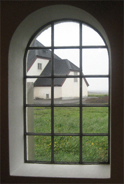
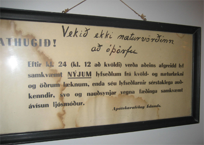

Title: „Vekið ekki næturvörðinn að óþörfu“
Slug: vekid-ekki-naeturvoerdinn-ad-othoerfu
Date: 2007-06-14 14:45:00
UID: 164
Lang: is
Author: Sólveig Ólafsdóttir
Author URL: 
Category: Safnafræði
Tags: 

Í fallegu gömlu og endurgerðu fjósi vestast á Seltjarnarnesi er safn, sem lætur afskaplega lítið fyrir sér fara og er starfrækt nánast í kyrrþey. Lyfjafræðisafnið er við Nesröðina, sem er hefðbundinn úthverfabotnlangi við fyrstu sýn en við enda hans er hin aldagamla og virðulega Nesstofa þaðan sem upphaf bæði formlegrar læknisfræði og lyfjafræði á Íslandi liggur. Frá Nesi er undrafagurt útsýni á góðum degi. Fjallahringurinn, allt frá Bláfjöllum, suður að Keili blasir við og svo til vesturs Snæfellsjökull og fjólubláu draumarnir, Akrafjallið og Skarðsheiðin. Krían gargar og fíflabreiðurnar brosa við sólinni þessa síðustu júnídaga.

Lyfjafræðisafnið er um margt sérstakt. Upphaf þess má rekja til nokkurra lyfjafræðinga sem tóku sig saman seint á áttunda tug síðustu aldar og hófu markvisst að safna munum og minjum tengdum apótekum og lyfjagerð á Íslandi. Fyrst voru hlutirnir geymdir í kjöllurum og ýmsum geymslum en fyrir nær tuttugu árum festu þeir kaup á gömlu útihúsunum við Nes á Seltjörn. Þeir stofnuðu sjálfseignarstofnun í kring um Lyfjafræðisafnið, sem er í eigu allra lyfjafræðinga á Íslandi. Með endalausri sjálfboðavinnu og nokkrum glæsilegum peningagjöfum komu lyffræðingar sér upp safnahúsi í endurgerðu og viðbyggðu fjósinu. Húsið mátti teljast fullbyggt árið 1994 og þar eru nú í gamla húsinu aðalsýningarsalur safnsins á jarðhæð og þar fyrir ofan fundarsalur. Í nýja húsinu eru skrifstofur lyfjafræðinga, skrifstofa Lyfjafræðisafnsins, bókasafn lyfjafræðinga, viðgerðarstofa og stór geymslukjallari. Á neðstu hæð tengigangsins er einnig lítill sýningarsalur.

Í Lyfjafræðisafninu er geymt allt hugsanlegt, sem tengist lyfjum á Íslandi; áhöld, bækur, skjöl, myndir og hvaðeina, sem segir sögu lyfjamála á Íslandi. Í sýningarsölunum eru innréttingar úr gömlum apótekum og auðvelt er að gera sér grein fyrir hvernig vinnuaðstaðan var í apótekunum á þeim tíma þegar nær öll lyf, hverju nafni sem þau nefndust voru framleidd á staðnum. Það voru ekki einungis lyf sem framleidd voru í apótekunum heldur alls kyns efni önnur, m.a. fyrir gull- og silfursmiði, framkallarar fyrir ljósmyndara,  hárlakk, alls kyns krydd og kryddblöndur, matarsódi og lyftiduft, fatalitir og bón svo fátt eitt sé nefnt. Sýnishorn af þessari fjölbreyttu framleiðslu apótekanna er til sýnis á safninu. Á einni leirkrúsinni, sem sannarlega er yfir hundrað ára gömul stendur meira að segja „Carry verum“ þ.e. alvöru karrý og það vottar enn fyrir fjarlægum ilmi úr krúsinni. 

Í einum sal safnsins gefur að líta heilt apótek með öllu sem því fylgir. Þegar Iðunnar Apótek flutti af Laugarveginum fóru innréttingarnar í heilu lagi á Lyfjafræðisafnið og var þeim komið þar fyrir með og jafnvel apótekaralakkríslyktin fylgdi með. Að koma inn í Iðunnar Apótek er eins og að stíga áratugi aftur í tímann. Þar slær gamla klukkan á heila og hálfa tímanum og þar gefur að líta sýnishorn af vinsælum snyrtivörum og ilmvötnum fyrri áratuga, barnamat og sápur og óborganlegar sígarettur, sem reyktar voru að læknisráði við astma. Í kjallaranum gefur svo að líta alls kyns tæki og tól sem notuð voru í lyfjaframleiðslu í stærri stíl; töfluvélar og pillubretti, stykkpillupressur, kremtúpuáfyllara og vélina sem bjó til hinar alræmdu lýsipillur sem neyddar voru ofan í skólabörn á sjöunda og áttunda áratugnum, svo fátt eitt sé nefnt.

Á gamalt veggspjald, sem hangir á safninu og áréttar ákvörðun Apótekarafélags Íslands um að einungis séu afgreidd lyf að næturlagi eftir nýjum lyfseðlum, hefur verið ritað stórum stöfum eftirfarandi ákall: „Vekið ekki næturvörðinn að óþörfu.“ Það má kannski líta á þessa beiðni sem kaldhæðin áhrínsorð yfir Lyfjafræðisafninu því fram til þessa hefur það verið mjög lítið sótt og starfsemi þess farið lágt. 

Í tilefni af 75 ára afmæli Lyfjafræðingafélags Íslands var ákveðið að auglýsa safnið sérstaklega fyrir lyfjafræðingunum sjálfum og hvetja þá til að koma og skoða tækin og tólin sem fyrirrennarar þeirra notuðu á sinni starfsævi. Safnið er ekki síður áhugavert fyrir okkur hin, sem hafa bara kynnst apótekum og lyfjum sem notendur og neytendur. Safnið, húsið sjálft og ekki síst umhverfið í Nesi á Seltjörn er forvitnilegt, heillandi og afar friðsælt og tilvalinn áfangastaður í gönguferð út á Gróttu eða í bíltúr um grónar einbýlishúsagötur vestast á Seltjarnarnesi.

Þó svo að þið leyfið næturverðinum að sofa þá er um að gera að halda safnverðinum á Lyfjafræðisafninu við efnið í sumar. Safnið er opið á þriðjudögum, fimmtudögum, laugardögum og sunnudögum fram í ágústlok frá kr. 13.00 — 17.00. Aðgangur er ókeypis og öllum heimill. Nánari upplýsingar gefur Sólveig Ólafsdóttir safnvörður, s. 8921215.

