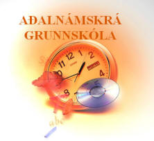

Title: Viðheldur aðalnámskrá grunnskóla félagslegum mismun?
Slug: vidheldur-adalnamskra-grunnskola-felagslegum-mismun
Date: 2006-12-14 11:19:00
UID: 119
Lang: is
Author: Kristján K. Stefánsson
Author URL: 
Category: Kennslufræði, Stjórnmálafræði
Tags: 

Samfélagið og hreyfiöfl innan þess hafa sögulega vídd sem er vert að skoða til að gera sér grein þeim breytingum sem hafa orðið, og hugsanlega munu verða, á skólakerfinu í framtíðinni. Þýski félags- og menntunarfræðingurinn Thomas Ziehe kom fram með kenningar sem urðu áhrifaríkar í lok áttunda áratugarins. Bakgrunnur þeirra var sú upplausn hugmyndalegs stöðugleika sem einkenndi 7. og 8. áratuginn, en þær hafa öðlast aukna og breytta merkingu í kjölfar þess að tölvutækni í framleiðslu og upplýsingatækni hefur að verulegu leyti leyst upp það iðnaðarsamfélag sem einkenndist af færiböndum og einföldum störfum (Gestur Guðmundsson, 2006). Ziehe leggur áherslu á orðið „menningarlega leysingu“ einstaklingsins sem einskonar samsvörun við leysingu hjúa úr vistarböndum á dögum iðnbyltingarinnar og afnám þrælahalds fyrr á öldum. Hann vill meina að álíka mikil bylting hafi orðið á hugarfari og tengslum einstaklings og samfélags og varð á sviði atvinnuhátta með iðnbyltingu og framrás kapítalismans. Ziehe byggir kenningar sínar m.a. á rannsóknum sálgreinenda sem greindu frá „hinu veika sjálfi“ sem vaxandi vandamáli í sálarlífi einstaklinga.

Sá „heilbrigði einstaklingur“ sem hefur sterkt sjálf og er viðmiðið í menningu nútímans virðist ekki ganga sem viðmið í samfélagi þar sem hið trausta er horfið og einstaklingurinn og sjálf hans standa berskjaldaðri en áður. Ziehe heldur því fram að þau áreiti sem mæta unglingum og ungu fólki, sem er að móta sjálfsmynd sýna, gangi miklu nær okkur en áreiti sem eldri kynslóðir urðu fyrir. Kenningar Ziehes hafa þróast á þann veg að skýringa á veiku sjálfi ungs fólks hefur verið leitað í almennu uppeldisumhverfi þeirra, einkum breyttri stöðu og vægi siðareglna, gilda og vaxandi óstöðugleika þeirrar merkingar sem líf þeirra og umhverfi hefur. Í rannsóknum sínum síðustu 20 árin hefur Ziehe gert þremur tilhneigingum skil. Þær eru:

* Afturblik (reflexivity): Aukin umhugsun um afleiðingar gerða okkar.

* Einstaklingsvæðing (individualization): Knýjandi nauðsyn þess að skilja okkur sjálf sem sérstaka og einstæða einstaklinga.

* Sjálfsköpun (makability): Það að taka sjálf ábyrgð á að þróa eigið einstaklingseðli.

Tilhneigingar Ziehes má tengja sömu tilhneigingum og félagsfræðingarnir Ulrich Beck og Anthony Giddens hafa fjallað um á síðari árum. Ziehe fjallar hinsvegar sérstaklega um afleiðingar þessara tilhneiginga á skólastarf. Hann hefur haldið því fram að nám geti ekki lengur miðast við hið heilsteypta sjálf, heldur sjálf sem er stöðugt að spegla sig í umhverfi sínu og er sífellt hætt við áföllum. Námsferlar ættu að styrkja hina menningarlegu leit og leitast við að draga úr varnarviðbrögðum, sem stafa af takmarkaðri tilfinningalegri festu og stöðugri óvissu. Ziehe nefnir jafnframt að við hinum breyttu lífskilyrðum megi greina þrennskonar viðbrögð, í félags-pólitískum skilningi:

* Siðvenjufesta (Conventionalism): Viðleitni til að skera sig sem minnst úr.

* Menningarleg leit (Cultural search): Höfnun viðtekinna gilda og tortryggni á allar forskriftir og algildar viðmiðanir.

* Nýíhaldsstefna (Neo-conservatism): Leit eftir fornum dyggðum og vegsömun þeirra.

Má ef til vill greina einhver þessara viðbragða í uppbyggingu almenna hluta aðalnámskrár grunnskóla frá 1999? 

Ef texti aðalnámskrár er skoðaður nákvæmlega má sjá í honum sterk einkenni nýíhaldsstefnu. Þetta kristallast í auknum áherslum á aga og stjórnun sem einkenndu skólakerfið fyrr á tíð. Jafnframt má finna ákall til enn eldri dyggða frá þeim tíma sem öll almenn menntun heyrði undir starf kirkjunnar. Dæmi um slíkt má sjá í eftirfarandi tilvitnun: „við framkvæmd skólastefnunnar ber að halda í heiðri gildum sem hafa reynst okkur Íslendingum best. Skólarnir hafa vaxið úr jarðvegi kristninnar og þær rætur mega aldrei slitna.“ (Aðalnámskrá bls. 6)

Þessi tilvitnun sem kemur úr inngangi aðalnámskrárinnar, sem undirrituð er af þáverandi menntamálaráðherra Birni Bjarnasyni, er athyglisverð í samanburði við skrif John Deweys sem má telja einn áhrifamesta kennslufræðing síðustu aldar. Í bók sinni _Reynsla og menntun_, sem kom fyrst út í Bandaríkjunum árið 1938, (og Gunnar Ragnarsson þýddi árið 2000) má finna skilgreiningu Deweys á hefðbundnum skóla: 

> Hefðbundni skólinn gat komist af á nokkurrar skipulega útfærðrar menntunarheimspeki. Nánast allt sem hann þurfti í þá veru voru nokkur almenn orð eins og menning, agi, hinn mikli menningararfur,  og þar fram eftir götunum, því að raunveruleg leiðsögn var ekki sótt til þeirra heldur til siðvenju og fastra hefða.  
> <cite>(Dewey, 2000)</cite>

Frekari tilvitnanir í áðurnefndan fyrrverandi menntamálaráðherra sýna svo ekki verður um villst áherslu hans á hefðbundna skólann, eins og Dewey skilgreindi hann á fyrri hluta 20. aldar. Á kjördæmisþingi reykvískra sjálfstæðismanna 25. janúar 1997 flutti Björn ræðu þar sem framtíðarsýn hans í menntamálum kom fram. Á heimasíðu Björns ([www.bjorn.is](http://www.bjorn.is)) má finna ræðuna í heild sinni en hér kemur valin tilvitnun úr ræðunni: 

> Það er víðar en í stjórnmálum, sem tískubylgjur hrífa menn með sér. Þetta gerist einnig í skólamálum. Hér á landi voru lög um barnaskóla fyrst sett fyrir réttum 90 árum, eða árið 1907. Síðan þá er mikið vatn til sjávar runnið, en vatnaskil urðu í fræðslumálum hér undir lok sjöunda áratugsins og við upphaf þess áttunda.
>
> Þeir, sem hafa skilgreint stefnubreytingu á þessum árum með gagnrýnum hætti, segja, að alls engin þörf hafi verið á henni. Hvorki foreldrar né kennarar hafi krafist breytinga. Til sögunnar hafi komið sérfræðingar, sem vildu sveigja íslenska barnaskólann að bandarískri skólastefnu með Svíþjóð sem millistykki. Stefnan hafi verið illa skilgreind, enda samin í flýti af félagsvísindamönnum, meðal annars til að friða taugaveiklaða bandaríska stjórnmálamenn, sem töldu sig vera að glutra niður forystu í vísindum, eftir að Sovétmenn urðu fyrstir til að senda mannað geimfar í kringum jörðina. 
> 
> Þessari breytingu á skólakerfinu hefur meðal annars verið lýst á þann veg, að kennarar hafi hætt að mennta kennara í kennaraskólum og þess í stað hafi sérfræðingar í uppeldis- og sálarfræðum tekið kennara í fóstur. Ekki nóg með það, heldur hafi kennisetningar í þessum fræðum ekki reynst haldgóð vísindi. Þannig hafi kenningar um þroskastig barna eftir aldri þeirra beinlínis stuðlað að metnaðarleysi í kennslu og námsframboði.
> 
> Mig skortir forsendur til að fella dóma um réttmæti þessarar gagnrýni. Á hinn bóginn tel ég, að heilbrigð skynsemi segi öllum, að agalaus skóli sé lítils virði, að skóli, sem hafnar samkeppni og prófum, skili ekki miklum árangri. Þá er það ekki sannfærandi, þegar því er haldið fram, að starf innan veggja skóla sé svo sérhæft og sérstakt, að foreldrum komi það ekki við, af því að þeir skilji það ekki.
>
> Hafi þetta verið ráðandi viðhorf við menntun kennara undanfarna áratugi er full ástæða til að breyta því.  
> <cite>(Björn Bjarnason, 1997)</cite>

Þessi tilvitnun er sett fram hér til þess að lesandinn geti gert sér grein fyrir að ekki er um mistúlkun að ræða. Í ofangreindri tilvitnun kristallast höfnun á félagsvísindum og andúð á ríkjandi skólastarfi þar sem illa menntuðum kennurum, agaleysi og skorti á samkeppni í skólastarfinu er kennt um árangursleysi í skólakerfinu. Samskonar höfnun hefur verið greind í málflutningi hægri afla á níunda áratugnum í Bandaríkjunum og Bretlandi (Apple, 1998).

Í ræðunni á kjördæmisþinginu notaði Björn heilbrigða skynsemi sem rökstuðning fyrir því að foreldrar eigi að hafa meira um það að segja hvaða starf fer fram í grunnskólum landsins. Í þessu má greina tvennt áhugavert. Annarsvegar þá tilhneigingu nýíhaldsafla að hafna rökstuddum fræðikenningum á grunni „heilbrigðrar skynsemi“ og hinsvegar þær efasemdir sem má greina gagnvart fagmennsku kennarastéttarinnar. 

Þegar persónulegar áherslur fyrrverandi menntamálaráðherra, eins og þær koma fram í ræðu og riti, eru bornar saman við texta aðalnámskrár má sjá að aðalnámskráin fylgir áherslum menntamálaráðherra og er rituð án nokkurrar skipulegrar útfærðrar menntunarheimspeki. Áherslan á hinn hefðbundna skóla er yfirgnæfandi með tilheyrandi afleiðingum fyrir þá hópa sem ekki tilheyra þeirri fyrirmyndarfjölskyldu sem aðalnámskráin er skrifuð til.

Fullyrða má að sá heimur sem við byggjum í dag einkennist af enn meira óöryggi og menningarlegri leysingu en sú heimsmynd sem myndaði bakgrunn aðalnámskrárinnar frá 1999. Spurning er hvaða afleiðingar þessar breytingar munu/ættu að hafa fyrir aðalnámskrána í framtíðinni. Þetta er svið sem krefst frekari rannsókna og skýrrar pólitískrar stefnu að hálfu stjórnvalda.

---

<small class="blurb">
Þessi grein er unnin uppúr rannsóknarverkefni sem skilað var í áfanganum Heimspeki og félagsfræði menntunar í Kennaraháskóla Íslands haustið 2006. Höfundar verkefnisins eru Svanborg Rannveig Jónsdóttir (svanjons@khi.is), Arthur W. Morthens (arthmort@khi.is) og Kristján Ketill Stefánsson (kristjan@khi.is). Verkefnið má nálgast með því að hafa samband við höfunda.
</small>

---

#### Heimildir

* _Aðalnámskrá grunnskóla. Almennur hluti._ (1999). Reykjavík: Menntamálaráðuneyti. http://bella.stjr.is/utgafur/AGalmennurhluti.pdf
* Apple, M. W. (1998). „Knowledge, pedagogy, and the conservative alliance.“ _Studies in the Literary Imagination_, 31(1), bls. 5.
* Björn Bjarnason. (1997). „Stefna í menntamálum - framtíðarsýn: Kjördæmisþing reykvískra sjálfstæðismanna 25. janúar 1997.“ Sótt 13. nóvember 2006, af http://www.bjorn.is
* Dewey, J. (2000). _Reynsla og menntun_ (Gunnar Ragnarsson þýddi). Reykjavík: Rannsóknarstofnun Kennaraháskóla Íslands.
* Gestur Guðmundsson. (2006). „Einstaklingsvæðing í síðnútíma.“ Námsefni fyrir námskeið í Kennaraháskóla Íslands haustið 2006.
* Svanborg R. Jónsdóttir, Arthur W. Morthens og Kristján Ketill Stefánsson. (2006). „Viðheldur aðalnámskrá félagslegum mismun?“ Rannsóknarverkefni í áfanganum Heimspeki og félagsfræði menntunar. Kennaraháskóli Íslands.

