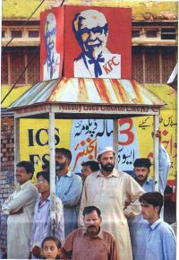

Title: Yfirlitið og saga samtímans
Slug: yfirlitid-og-saga-samtimans
Date: 2007-04-26 10:55:00
UID: 153
Lang: is
Author: Magnús Sveinn Helgason
Author URL: 
Category: Sagnfræði
Tags: 

Saga yfirlitsnámskeiðsins í bandarískum háskólum hefur endurspeglað breytingar á bandarísku samfélagi og stöðu Bandaríkjanna á alþjóðavettvangi. Yfirlitið hefur svarað þörf háskólasamfélagsins til að skýra fyrir bandarísku þjóðinni hvernig samtíminn, eins og hann birtist almenningi, bæði félagslega og alþjóðlega, sé afsprengi sögunnar.

Það má með nokkrum sanni segja að öll sagnfræði sé samtímamiðuð, því hlutverk sagnfræðinnar er ekki að endurreisa fortíðina eða endurskapa hana, hvorki í litlum pörtum né í heild. Eins og Marcel Proust benti á er fortíðin, með öllum sínum smákökuilm, löngu horfin, og það er sama hvað við reynum, hún fæst ekki endurreist. Sagnfræði snýst því ekki (og hefur svo sem aldrei snúist) um að galdra fortíðina fram í nútímanum, heldur um að segja merkingarbærar sögur um fortíðina — sögur sem gera nútímamönnum kleift að skilja þá veröld sem þeir byggja hverju sinni. Tilgangur yfirlitsnámskeiðsins (og yfirlitsins), er því ekki að setja saman lista yfir fortíðina „eins og hún var“, heldur að lýsa henni með þeim hætti að hún hafi merkingu fyrir lesendum og nemendum.

Á fyrri hluta aldarinnar þörfnuðust Bandaríkjamenn sögu sem samræmdist sjálfsmynd þjóðarinnar sem arftaka vestrænnar menningar og því náttúrulegan bandamann Evrópumanna í útbreiðslu og viðhaldi „vestrænnar siðmenningar“. Heimsstyrjaldirnar og óvissuástand millistríðsáranna juku aðeins á mikilvægi þessarar heimsmyndar fyrir menntaða Bandaríkjamenn. _Western Civ_, með evrópumiðjun sína, svaraði þessari þörf. Námskeiðið hélt vinsældum sínum á eftirstríðsárunum, enda þjónaði það áfram því hlutverki að réttlæta bandaríska þjóðerniskennd þó það félli ekki eins vel að því alþjóðastjórnmálaumhverfi sem skapaðist við upplausn evrópsku nýlenduveldanna. Kalda stríðið dró Bandaríkin inn í átök í Afríku, Asíu og Suður Ameríku, en vegna einokunarstöðu _Western Civ_ fengu bandarískir háskólanemar mjög skakka sögulega mynd af stjórnmálaástandi eftirstríðsáranna. 

Veraldarsagan kom fram sem svar við þessu vandamáli. Bæði átti hún að bjóða bandarískum háskólanemum upp á mannkynssögu, sem gæti gert tilkall til þess að vera saga alls mannkynsins — ekki bara Evrópubúa — en einnig að veita þeim skilning á sögu þjóða í Asíu, Afríku og Suður Ameríku, þar sem átök kaldastríðsins og fjárfestingar stórfyrirtækja höfðu teygt áhrif Bandaríkjanna.
Það tók veraldarsöguna þó mjög langan tíma að ná traustri stöðu innan bandarískra háskóla og í millitíðinni hélt _Western Civ_ áfram að einoka stöðu stóra yfirlitsnámskeiðsins. Veraldarsaga átti á brattan að sækja í stærri háskólum, hana skorti frásagnarhefð, og þó margir smærri háskólar tækju að bjóða upp á veraldarsögu skorti kennara bæði þjálfun og góðar kennslubækur. Sú stórsaga og það sögulega yfirlit sem virtustu sagnfræðideildir Bandaríkjanna buðu upp á var því allt fram á níunda áratuginn undir sterkum áhrifum _Western Civ_ og frásagnarmáta þess. Þó ráðnir væru sérfræðingar í kvennasögu, sögu Suður Ameríku eða „subaltern studies“ var yfirlitssagan eftir sem áður „evrópumiðjuð“, gerendur hennar voru nánast allir hvítir karlmenn, meðan íbúar annarra heimshluta höfðu lítið sögulegt hlutverk annað en að vera fórnarlömb vestrænnar heimsvaldastefnu eða viðfangsefni vestrænna umbótamanna. Þó _Western Civ_ hafi hætt að leika það lykilhlutverk sem það lék á fyrri hluta aldarinnar hélt söguþráður þess og frásögn þó velli.

Á eftirstríðsárunum voru gerðar nokkrar tilraunir til þess að setja saman önnur „meta-narrative“. Dæmi um þetta eru _Modernization Theory_ og _World System Theory_, sem var tilraun til að skýra áframhaldandi vanþróun þriðja heimsins. Sagnfræðingar höfnuðu báðum. Kenningin um nútímavæðingu var jafn evrópumiðjuð og _Western Civ_, og einkenndist af frekar vafasamri nauðhyggju, og þó veraldarkerfiskenning Immanuel Wallerstein hafi virtst skýra sum einkenni samtímans samræmdist hún þó engan veginn sögunni og gat ekki heldur boðið upp á sannfærandi skýringu á iðnvæðingu sumra Asíuríkja.

Sagnfræðideildir stærri háskóla brugðust við þessu með því að auka námskeiðaúrval og ráða sérfræðinga í sögu fleiri heimshluta. Yfirlitið afbyggðist því innanfrá — aukin þekking á sögunni gerði að verkum að stöðugt erfiðara var að setja saman yfirlit: hvað ætti að taka með og hvað ætti að skilja út. Sagnfræðingar sem fengust við sögu annarra heimshluta en Evrópu og Norður Ameríku urðu einnig að berjast við fordóma sem voru innbyggðir í evrópumiðjað yfirlit _Western Civ_.

Fræðimenn brugðust við þessu með tvennum hætti — annarsvegar voru sagnfræðingar sem litu svo á að mest aðkallandi verkefni sagnfræðinnar væri afmiðjun og eðlilegast væri að hafna yfirlitsnámskeiðinu algjörlega. Hins vegar þeir sem trúðu á draum Leften Stavrianos og William McNeill um raunverulega mannkynssögu sem gæti bæði veitt sögulegt yfirlit og opnað augu nemenda fyrir hversu fjölbreytileg og flókin veröldin væri. Markmið þeirra var að brjótast út úr þröngum ramma þjóðríkisins og yfirstíga þá evrópumiðjun sem einkenndi stóru yfirlitsnámskeiðin. Bandarískir háskólanemar þörfnuðust sögu sem gat varpað ljósi á atburði í fjarlægum löndum og sem endurspeglaði betur aukna fjölbreytni háskólasamfélagsins.

Efasemdir um hvort sagnfræðin gæti eða ætti að bjóða upp á einhverskonar heildstætt yfirlit náðu hámarki á níunda áratugnum, en sagnfræðingar sem voru undir áhrifum frá póstmódernískum hugsuðum höfnuðu hefðbundinni sagnfræði — þar á meðal yfirlitinu. Gagnrýni á „meta narratives“ eða yfirlitið er kjarni póstmódernískrar hugsunar. Þetta kemur meðal annars skýrt fram í _The Postmodern Condition_, eftir Jean-François Lyotard, (kom út 1979 — ensk þýðing 1984): „Simplifying to the extreme, I define postmodern as incredulity towards metanarratives“. Lyotard var þeirrar skoðunar að yfirlitið væri ætíð tæki í höndum valdhafa, það væri „totalitarian“, „reductionist“ og einkenndist af nauðhyggju.[^1] Þó gagnrýni á yfirlitið eigi sér fleiri rætur, og sé alþjóðlegt fyrirbrigði en ekki einvörðungu bandarískt, er nauðsynlegt að skilja vinsældir þessarar hugsunar í Bandaríkjunum í ljósi sögu yfirlitsins. 

Þessari gagnrýni hefur yfirleitt verið hafnað af veraldar- og hnattsögufræðingum, sem halda því fram að besta leiðin til að takast á við evrópumiðjun og nauðhyggju eldri frásagnarhefðar sé að skrifa ný og betri yfirlit. Áframhaldandi tilraunir til að ... 

> „deconstruct“, „provincialize“, „fragment“, „proliferate“, „destabilize“ and „treat with incredulity“ any meta-narratives purporting to be global, on the grounds that they will be contaminated by Eurocentric exclusions, or based upon ways of representing the past derived from Western social science ...

eru að mati Patrick O’Brian „subject to decreasing intellectual returns“. Evrópumiðjun verður ekki eytt úr vestrænni sagnfræði með afhjúpunum og yfirlýsingum einum saman: „Historians need to craft new, more inclusive and persuasive general narratives that might hold together without the fishy glue of Eurocentrism.“[^2] Þetta verk tók langan tíma, en á tíunda áratugnum voru veraldarsögufræðingar orðnir á einu máli um að fram hefði komið sæmilega sannfærandi frásagnarhefð í veraldarsögu. Veraldarsagan var þó áfram mjög þunglamaleg — og í áherslu sinni á söguna frá árdögum mannkyns til okkar daga gat hún ekki skýrt samtímann eða hnattvæðinguna, sem ásamt póstmódernismanum var talinn mikilvægasta einkenni síðnútímans. 

Tilkoma hnattsögunnar við lok tuttugustu aldarinnar má skilja sem viðbragð sagnfræðinga við breytingum á samtímanum. Endalok kalda stríðsins og vaxandi mikilvægi hnattvæðingar kölluðu á nýtt yfirlit — nýja stórsögu, eða nýtt „meta narrative“, sem gat skýrt veröldina eins og hún birtist háskólanemum. Michael Geyer og Charles Bright tala um að veröldin, eða samtíminn, hafi orðið „munaðarlaus“ þegar eldri stórsaga missti skýringargildi sitt.

> But [...] this is not a loss that can be remedied by a more all-in, encyclopedic approach, as if equal time for all the world’s histories will make history whole. Not only is a compendium of all histories likely to be bulky and unpresentable, something historians find distasteful and open to error and sloppiness, but it misses the nature of the break that constitutes world history in a global age.

Hnattvæðingin hafði skapað áður óþekkt ástand, _globality_. Sögu þess og uppruna var ekki hægt að segja með hjálp þeirrar frásagnarhefðar sem veraldarsagan hafði byggt á. Geyer og Bright lýsa þessu sem hruni eldri frásagnarhefðar: „World history, with Western history writ larger than others, did not turn out as the narrative prophesied...“.[^3] Yfirlitið hafði fyrir löngu hætt að samræmast upplifun sagnfræðinga og háskólanema á samtímanum: Bilið milli félagslegs raunveruleika og umhverfis Bandaríkjanna á alþjóðavettvangi annarsvegar og söguþráðar yfirlitsins hins vegar, var of mikið. Yfirlitið hafði ekki „liðið undir lok“, heldur hafði sagnfræðingum mistekist að bjóða upp á sannfærandi sögu fyrir samtímann. 

Hnattsögu má því skilja sem tilraun sagnfræðinga til að bregðast við kreppu yfirlitsins í kennslustofunni, þar sem bæði sagnfræði og ekki síst sögunni er miðlað til næstu kynslóða, tilraun til þess að bregðast við alvarlegustu annmörkum eldri stórsögu. Hugmyndir Lyotard og annarra póstmódernista nutu stuðnings innan sagnfræðinnar á níunda áratugnum ekki síst vegna þess að mörgum sagnfræðingum fannst réttilega að ríkjandi yfirlits- og stórsaga byggðist á karl- og evrópulægri frásagnarhefð sem þjónaði hagsmunum vestrænnar heimsvaldahyggju og þjónaði ekki hagsmunum háskólanema í fjölmenningarlegu samfélagi. Yfirlitssagan, eins og hún var víðast kennd, þótti því standa í vegi félagslegs réttlæti og framfara. Þó það megi einnig rökstyðja gagnrýni á yfirlitið með heimspekilegum hætti, virðast þessi siðferðislegu rök yfirleitt hafa verið í forgrunni. 

Í upphafi nýrrar aldar er löngu tímabært að mannkynið eignist raunverulega sögu. Hún þarf ekki að ná frá upphafi til okkar daga, né þarf hún að fjalla um alla sögulega mikilvæga atburði og gerendur, því engin saga getur gert sér vonir til að endurspegla fortíðina í heild eða fanga einhvern tímalausan sannleik í sögunni. Saga mannkynsins og veraldarinnar þarf hins vegar að geta útskýrt fyrir okkur hver við erum og hvernig veröldin í kringum okkur varð til. Án slíks skilnings er engin von til þess að við getum leyst aðkallandi vandamál tengd hnattvæðingu, eða fundið okkur stað í samtímanum.

Íslendingar, líkt og aðrar þjóðir, þurfa að finna leiðir til að sætta eldri yfirlitssögu og þjóðlega menningu við nýjan fjölþjóðlegan veruleika. Þau yfirlit og sú stórsaga sem háskólanemar, fjölmiðlar og almenningur hafa úr að velja í dag getur ekki sinnt þessu hlutverki. Ef við sagnfræðingar semjum ekki ný yfirlit, nýjan söguþráð fyrir stórsöguna, og bjóðum nemendum upp á skýringar á sögulegum uppruna samtímans, er hættan sú að aðrar fræðigreinar geri það, eða að eldri evrópumiðjuð „mannkynssaga“ lifi áfram góðu lífi.

---

<small class="blurb">
<strong>15. desember 2007:</strong> Höfundur óskar að tekið sé fram: Þessi grein er fyrstu drög að stærra verki sem er í vinnslu.
</small>

[^1]: Jean-François Lyotard, _The Postmodern Condition: A Report on Knowledge_, þýdd af Geoff Bennington og Brian Massumi, (Minneapolis, 1984) bls. xxiv.
[^2]: Sjá Patrick O’Brian, „Historiographical traditions and modern imperatives for the restoration of global history“, _Journal of Global History_ (2006), 1:1, bls. 3-39, tilvitnun bls. 33.
[^3]: Michael Geyer; Charles Bright, „World History in a Global Age“, _The American Historical Review_, 100:4, (október 1995), bls. 1034-1060. Tilvitnanir á bls. 1042 og 1041.

